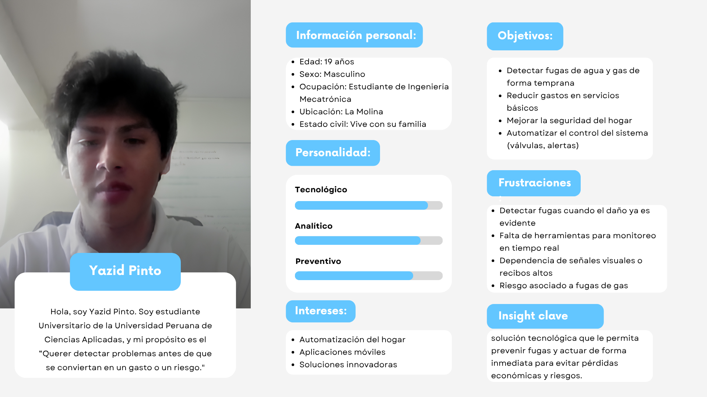
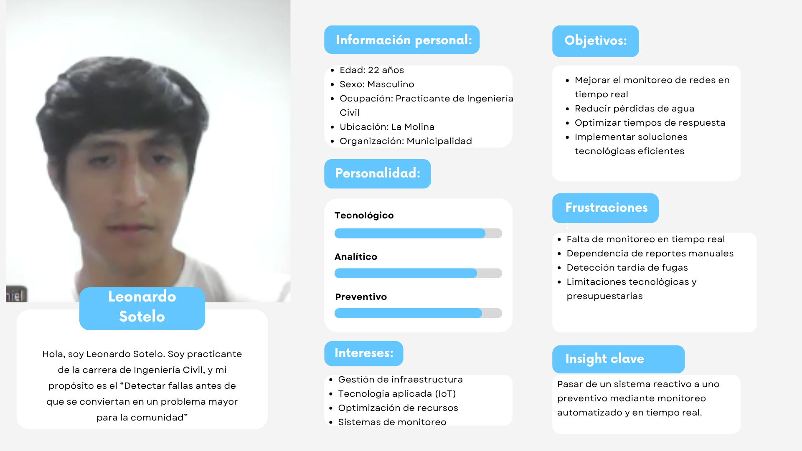
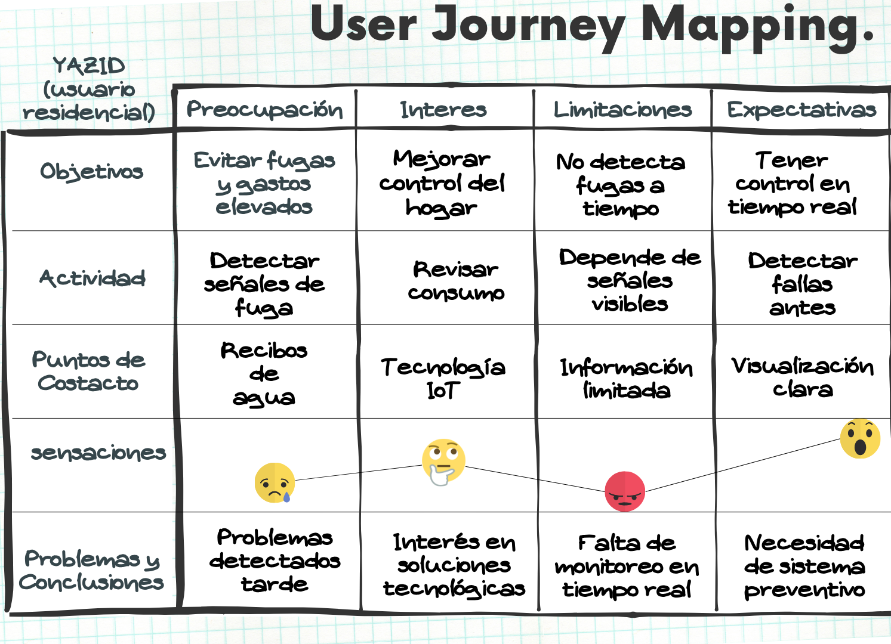
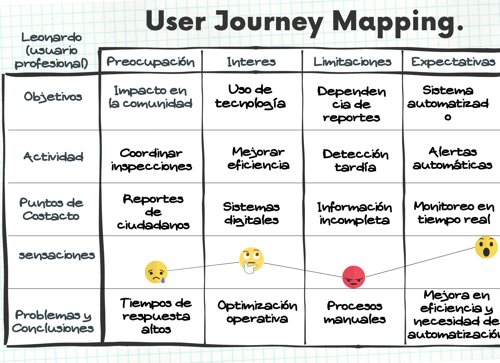

# Low-cortisol

  

  
Universidad Peruana de Ciencias Aplicadas

  
Facultad de Ingeniería

  
Carrera: Ingeniería de Software

  
<b>Ciclo: 2026</b>

  
Código del curso: 1ASI0730

  
Nombre del curso: Aplicaciones Web

  
NRC: 12144

  
Nombre del profesor: Efraín Ricardo Bautista Ubillús

  
<b>Informe de Trabajo Final</b>

  
Nombre del startup: LowCortisol

  
Nombre del producto: LowCortisol

  <h3>Integrantes</h3>

  <table>
    <thead>
      <tr>
        <th>Código</th>
        <th>Apellidos y Nombres</th>
      </tr>
    </thead>
    <tbody>
      <tr>
        <td>U202413930</td>
        <td>Condori Torres, Miguel Anibal</td>
      </tr>
      <tr>
        <td>U202115277</td>
        <td>Delgado Perez, James Caleb</td>
      </tr>
      <tr>
        <td>U20241E406</td>
        <td>Loa Rojas, Jean Franck</td>
      </tr>
      <tr>
        <td>U--------</td>
        <td>Montalvo Vasquez, Bruno Rodrigo</td>
      </tr>
      <tr>
        <td>U202411378</td>
        <td>Quiliano Motta, Kirk Douglas</td>
      </tr>
    </tbody>
  </table>
     
  
<b>Abril, 2026</b>

## Registro de Versiones del Informe

| Versión |  Fecha   |                                       Autor                                        |                                                  Descripción de modificación                                                   |
| :-----: | :------: | :--------------------------------------------------------------------------------: | :----------------------------------------------------------------------------------------------------------------------------: |
|   TB1   | 03/04/2026 | Todos | Avance del trabajo: Completando el contenido del Documento |
|   TP1   |            |       |                                                            |
|   TB2   |            |       |                                                            |
|   TF1   |            |       |                                                            |

## Project Report Collaboration Insights
A continuación, se detallan los repositorios utilizados a lo largo del proyecto:

#### Link del repositorio del Reporte:

- 

#### Link del repositorio de la Landing Page:

- 

#### Link del repositorio del Frontend:

- 

#### Link del repositorio del Backend:

- 

### **Entrega TB1:**
[text]

##### Participación por integrante:

- 

# Contenido

## Índice

- [Registro de versiones del informe](#registro-de-versiones-del-informe)

- [Project Report Collaboration Insights](#project-report-collaboration-insights)

- [Contenido](#contenido)

- [Student Outcome](#student-outcome-1)

- [Capítulo I: Introducción](#capitulo-i-introduccion)
  - [1.1. StartUp Profile](#11-startup-profile)
    - [1.1.1. Descripción de la StartUp](#111-descripción-de-la-startup)
    - [1.1.2. Perfiles de Integrantes del equipo](#112-perfiles-de-integrantes-del-equipo)
  - [1.2. Solution Profile](#12-solution-profile)
    - [1.2.1. Antecedentes y Problemática](#121-antecedentes-y-problemática)
    - [1.2.2. Lean UX Process](#122-lean-ux-process)
      - [1.2.2.1. Lean UX Problem Statements](#1221-lean-ux-problem-statements)
      - [1.2.2.2. Lean UX Assumptions](#1222-lean-ux-assumptions)
      - [1.2.2.3. Lean UX Hyphotesis Statements](#1223-lean-ux-hyphotesis-statements)
      - [1.2.2.4. Lean UX Canvas](#1224-lean-ux-canvas)
  - [1.3. Segmentos objetivo](#13-segmentos-objetivo)
- [Capítulo II: Requirements Elicitation & Analysis]()
  - [2.1. Competidores](#21-competidores)
    - [2.1.1. Análisis competitivo](#211-análisis-competitivo)
    - [2.1.2. Estrategias y tácticas frente a competidores](#212-estrategias-y-tácticas-frente-a-competidores)
  - [2.2. Entrevistas](#22-entrevistas)
    - [2.2.1. Diseño de entrevistas](#221-diseño-de-entrevistas)
    - [2.2.2. Registro de entrevistas](#222-registro-de-entrevistas)
    - [2.2.3. Análisis de entrevistas](#223-análisis-de-entrevistas)
  - [2.3. Needfinding](#23-needfinding)
    - [2.3.1. User Persona](#231-user-persona)
    - [2.3.2. User Task Matrix](#232-user-task-matrix)
    - [2.3.3. User Journey Mapping](#233-user-journey-mapping)
    - [2.3.4. Empathy Mapping](#234-empathy-mapping)
  - [2.4 Big Picture Event Storming](#24-big-picture-event-storming)
  - [2.5 Ubiquitous Language](#25-ubiquitous-language)
- [Capítulo III: Requirements Specification]()
  - [3.1. User Stories](#31-user-stories)
  - [3.2. Impact Mapping](#32-impact-mapping)
  - [3.3. Product Backlog](#33-product-backlog)
- [Capítulo IV: Product Design]()
  - [4.1. Style Guidelines](#41-style-guidelines)
    - [4.1.1. General Style Guidelines](#411-general-style-guidelines)
    - [4.1.2. Web Style Guidelines](#412-web-style-guidelines)
  - [4.2. Information Architecture](#42-information-architecture)
    - [4.2.1. Organization Systems](#421-organization-systems)
    - [4.2.2. Labeling Systems](#422-labeling-systems)
    - [4.2.3. SEO Tags and Meta Tags](#423-seo-tags-and-meta-tags)
    - [4.2.4. Searching Systems](#424-searching-systems)
    - [4.2.5. Navigation Systems](#425-navigation-systems)
  - [4.3. Landing Page UI Design](#43-landing-page-ui-design)
    - [4.3.1. Landing Page Wireframe](#431-landing-page-wireframe)
    - [4.3.2. Landing Page Mock-up](#432-landing-page-mock-up)
  - [4.4. Web Applications UX/UI Design](#44-web-applications-uxui-design)
    - [4.4.1. Web Applications Wireframes](#441-web-applications-wireframes)
    - [4.4.2. Web Applications Wireflow Diagrams](#442-web-applications-wireflow-diagrams)
    - [4.4.3. Web Applications Mock-ups](#443-web-applications-mock-ups)
    - [4.4.4. Web Applications User Flow Diagrams](#444-web-applications-user-flow-diagrams)
  - [4.5. Web Applications Prototyping](#45-web-applications-prototyping)
  - [4.6. Domain-Driven Software Architecture](#46-domain-driven-software-architecture)
    - [4.6.1. Design-Level Event Storming](#461-design-level-event-storming)
    - [4.6.2. Software Architecture Context Diagram](#462-software-architecture-context-diagram)
    - [4.6.3. Software Architecture Container Diagrams](#463-software-architecture-container-diagrams)
    - [4.6.4. Software Architecture Components Diagrams](#464-software-architecture-components-diagrams)
  - [4.7. Software Object-Oriented Design](#47-software-object-oriented-design)
    - [4.7.1. Class Diagrams](#471-class-diagrams)
  - [4.8. Database Design](#48-database-design)
    - [4.8.1. Database Diagram](#481-database-diagram)
- [Capítulo V: Product Implementation, Validation & Deployment]()
  - [5.1. Software Configuration Management](#51-software-configuration-management)
    - [5.1.1. Software Development Environment Configuration](#511-software-development-environment-configuration)
    - [5.1.2. Source Code Management](#512-source-code-management)
    - [5.1.3. Source Code Style Guide & Conventions](#513-source-code-style-guide--conventions)
    - [5.1.4. Software Deployment Configuration](#514-software-deployment-configuration)
  - [5.2. Landing Page, Services & Applications Implementation](#52-landing-page-services--applications-implementation)
    - [5.2.1. Sprint 1](#521-sprint-1)
      - [5.2.1.1. Sprint Planning 1](#5211-sprint-planning-1)
      - [5.2.1.2. Aspect Leaders and Collaborators](#5212-aspect-leaders-and-collaborators)
      - [5.2.1.3. Sprint Backlog 1](#5213-sprint-backlog-1)
      - [5.2.1.4. Development Evidence for Sprint Review](#5214-development-evidence-for-sprint-review)
      - [5.2.1.5. Execution Evidence for Sprint Review](#5215-execution-evidence-for-sprint-review)
      - [5.2.1.6. Services Documentation Evidence for Sprint Review](#5216-services-documentation-evidence-for-sprint-review)
      - [5.2.1.7. Software Deployment Evidence for Sprint Review](#5217-software-deployment-evidence-for-sprint-review)
      - [5.2.1.8. Team Collaboration Insights during Sprint](#5218-team-collaboration-insights-during-sprint)
    - [5.2.2. Sprint 2](#522-sprint-2)
      - [5.2.2.1. Sprint Planning 2](#5221-sprint-planning-2)
      - [5.2.2.2. Aspect Leaders and Collaborators](#5222-aspect-leaders-and-collaborators)
      - [5.2.2.3. Sprint Backlog 2](#5223-sprint-backlog-2)
      - [5.2.2.4. Development Evidence for Sprint Review](#5224-development-evidence-for-sprint-review)
      - [5.2.2.5. Execution Evidence for Sprint Review](#5225-execution-evidence-for-sprint-review)
      - [5.2.2.6. Services Documentation Evidence for Sprint Review](#5226-services-documentation-evidence-for-sprint-review)
      - [5.2.2.7. Software Deployment Evidence for Sprint Review](#5227-software-deployment-evidence-for-sprint-review)
      - [5.2.2.8. Team Collaboration Insights during Sprint](#5228-team-collaboration-insights-during-sprint)
    - [5.2.3. Sprint 3](#523-sprint-3)
      - [5.2.3.1. Sprint Planning 3](#5231-sprint-planning-3)
      - [5.2.3.2. Aspect Leaders and Collaborators](#5232-aspect-leaders-and-collaborators)
      - [5.2.3.3. Sprint Backlog 3](#5233-sprint-backlog-3)
      - [5.2.3.4. Development Evidence for Sprint Review](#5234-development-evidence-for-sprint-review)
      - [5.2.3.5. Execution Evidence for Sprint Review](#5235-execution-evidence-for-sprint-review)
      - [5.2.3.6. Services Documentation Evidence for Sprint Review](#5236-services-documentation-evidence-for-sprint-review)
      - [5.2.3.7. Software Deployment Evidence for Sprint Review](#5237-software-deployment-evidence-for-sprint-review)
      - [5.2.3.8. Team Collaboration Insights during Sprint](#5238-team-collaboration-insights-during-sprint)
    - [5.2.4. Sprint 4](#524-sprint-4)
      - [5.2.4.1. Sprint Planning 4](#5241-sprint-planning-4)
      - [5.2.4.2. Aspect Leaders and Collaborators](#5242-aspect-leaders-and-collaborators)
      - [5.2.4.3. Sprint Backlog 4](#5243-sprint-backlog-4)
      - [5.2.4.4. Development Evidence for Sprint Review](#5244-development-evidence-for-sprint-review)
      - [5.2.4.5. Execution Evidence for Sprint Review](#5245-execution-evidence-for-sprint-review)
      - [5.2.4.6. Services Documentation Evidence for Sprint Review](#5246-services-documentation-evidence-for-sprint-review)
      - [5.2.4.7. Software Deployment Evidence for Sprint Review](#5247-software-deployment-evidence-for-sprint-review)
      - [5.2.4.8. Team Collaboration Insights during Sprint](#5248-team-collaboration-insights-during-sprint)
  - [5.3. Validation Interviews]()
    - [5.3.1. Diseño de Entrevistas](#531-diseño-de-entrevistas)
    - [5.3.2. Registro de Entrevistas](#532-registro-de-entrevistas)
    - [5.3.3. Evaluaciones según heuristicas](#533-evaluaciones-segun-heuristicas)
  - [5.4. Video About-the-Product](#54-video-about-the-product)
- [Conclusiones](#conclusiones)
  - [Conclusiones y recomendaciones](#conclusiones-y-recomendaciones)
- [Bibliografía](#bibliografía)
- [Anexos](#anexos)

## Student Outcome

Objetivo general, ABET – EAC - Student Outcome 3: Capacidad de comunicarse efectivamente con un rango de audiencias.
| Criterio Especifico | Acciones realizadas | Conclusiones |
|--|--|--|
| Comunica oralmente con efectividad a diferentes rangos de audiencia. | Miguel Condori  TB1:  TP1:   TB2:   TF1:     James Delgado  TB1:  TP1:   TB2:   TF1:     Jean Loa   TB1:   TP1:   TB2:   TF1:     Bruno Montalvo   TB1:   TP1:   TB2:   TF1:    Kirk Quiliano   TB1:   TP1:   TB2:   TF1:|	 |
| Comunica por escrito con efectividad a diferentes rangos de audiencia | Miguel Condori  TB1:  TP1:   TB2:   TF1:     James Delgado  TB1:  TP1:   TB2:   TF1:     Jean Loa   TB1:   TP1:   TB2:   TF1:     Bruno Montalvo   TB1:   TP1:   TB2:   TF1:    Kirk Quiliano   TB1:   TP1:   TB2:   TF1:|	 |

# Capitulo I: Introducción

## 1.1. StartUp Profile

### 1.1.1. Descripción de la StartUp
El presente informe pretende documentar el desarrollo del Startup “NOMBRESTARTUP”, el cual busca mejorar la prevención y gestión de incidentes en tuberías de agua y gas mediante el uso de tecnología IoT y monitoreo en tiempo real. A través de su aplicativo “NOMBAPLIC”, los usuarios podrán supervisar el estado de sus instalaciones, recibir alertas inmediatas ante fugas o anomalías y tomar acciones rápidas como cerrar válvulas de forma remota o solicitar soporte técnico.

De este modo, la empresa busca reducir pérdidas económicas, prevenir riesgos para la salud y mejorar la seguridad en hogares, hoteles y otros establecimientos. Asimismo, la solución permitirá optimizar el consumo de recursos y fomentar una gestión más eficiente del agua y gas. Para ello, nuestro grupo demostrará conocimientos en desarrollo web, bases de datos, integración de sensores y gestión de servicios en la nube.

---

## Misión
Nuestra misión es facilitar a los usuarios el control y supervisión de sus sistemas de agua y gas mediante tecnología inteligente, alertas en tiempo real y herramientas de respuesta rápida. Buscamos generar confianza, ahorro y seguridad en hogares y negocios, siempre con un enfoque en innovación, accesibilidad y mejora continua.
---

## Visión
Nuestra visión es convertirnos en la empresa líder en soluciones tecnológicas de monitoreo y prevención de fugas de agua y gas en el Perú. Buscamos brindar mayor seguridad, eficiencia y tranquilidad a las personas y negocios mediante herramientas innovadoras y accesibles. Creemos que la tecnología puede prevenir incidentes, reducir desperdicios y mejorar la calidad de vida de la población.

## Valores
Nuestros valores principales son los siguientes:
- Innovación: Uso de tecnología moderna para resolver problemas cotidianos de forma eficiente.
- Seguridad: Priorizamos la protección de las personas, propiedades y negocios.
- Responsabilidad: Promovemos el uso adecuado de recursos como el agua y el gas.
- Colaboración: Valoramos el trabajo en equipo y la relación con usuarios y aliados estratégicos.
- Calidad: Buscamos ofrecer un servicio confiable, estable y fácil de utilizar.

### 1.1.2. Perfiles de integrantes del equipo
| **Nombre Completo del integrante**    |	**Descripcion de la carrera** | **Fotografia** | **Conocimientos y habilidades**
| :------------------------------------ |:------------------------------------ |:------------------------------------ |:------------------------------------ |
| Condori Torres, Miguel Anibal      |Ingeniería de Software Universidad Peruana de Ciencias Aplicadas |  | text
| Delgado Perez, James Caleb      |Ingeniería de Software Universidad Peruana de Ciencias Aplicadas|  | text
| Loa Rojas, Jean Franck      |Ingeniería de Software Universidad Peruana de Ciencias Aplicadas |  | Soy Jean Franck Loa Rojas, estudiante de 5to ciclo de la carrera de Ingeniería de Software. Actualmente estoy abierto a oportunidades laborales para emplear mis conocimientos en programación y obtener experiencia trabajando de la mano con conocedores y profesionales de mi rubro académico. Estoy emocionado por todo lo que puede venir en el futuro, y las colaboraciones tecnológicas entre países para compartir conocimiento y prosperar una nación unida y pacífica.
| Montalvo Vasquez, Bruno Rodrigo      |carrera|  | text
| Quiliano Motta, Kirk Douglas      |carrera|  | text

## 1.2 *Solution Profile*
### 1.2.1 Antecedentes y problemática
En la actualidad, tanto en hogares como en negocios e instituciones, el uso de tuberías para la distribución de agua y gas es fundamental. Sin embargo, la mayoría de estos sistemas carecen de mecanismos de monitoreo en tiempo real, lo que dificulta la detección oportuna de fugas o fallas. A nivel mundial, se han desarrollado soluciones basadas en tecnología IoT para el monitoreo de recursos, pero su adopción aún es limitada en muchos contextos debido a costos, falta de conocimiento o baja accesibilidad tecnológica. En el contexto local, es común que los usuarios detecten fugas de agua o gas de forma tardía, cuando ya existen consecuencias como:

- Incremento excesivo en los recibos de servicios.
- Daños en infraestructura (paredes, pisos, tuberías).
- Riesgos para la salud (intoxicación por gas).
- Posibles accidentes graves como explosiones.

Además, la dificultad para encontrar técnicos confiables de forma inmediata agrava la situación, incrementando el tiempo de respuesta ante emergencias. Por ello, se identifica la necesidad de una solución tecnológica que permita el monitoreo continuo, la detección temprana de anomalías y la respuesta rápida ante incidentes.

## 5W & 2H
Who (¿Quiénes?)
Los principales usuarios de la solución son personas que viven en hogares, administradores de hoteles y dueños o responsables de negocios que utilizan agua y gas en sus actividades diarias. También se considera al personal de mantenimiento encargado de revisar las instalaciones.

What (¿Qué?)
El problema principal es la falta de monitoreo constante en las tuberías de agua y gas. Esto provoca que muchas fugas sean detectadas tarde, generando desperdicio de recursos, gastos elevados, daños en la infraestructura y riesgos para la seguridad.

Where (¿Dónde?)
Esta problemática puede presentarse en viviendas, hoteles, restaurantes, edificios y otros establecimientos que cuenten con redes internas de agua y gas.

When (¿Cuándo?)
Puede ocurrir en cualquier momento, especialmente cuando no existe supervisión constante, las tuberías son antiguas o no se realiza mantenimiento preventivo.

Why (¿Por qué?)
Porque la mayoría de personas detecta los problemas cuando ya son visibles, por ejemplo al notar humedad, malos olores, baja presión o recibos elevados. Además, muchas instalaciones no cuentan con herramientas tecnológicas para prevenir fallas.

How (¿Cómo?)
La solución propone utilizar sensores IoT conectados a una plataforma web que permita monitorear en tiempo real, enviar alertas inmediatas y tomar acciones rápidas como cerrar válvulas o contactar soporte técnico.

How Much (¿Cuánto impacta?)
El impacto puede ser económico por altos costos en recibos y reparaciones, operativo por interrupciones del servicio y de seguridad por riesgos como intoxicaciones o explosiones en caso de fugas de gas.

## Objetivos
Corto Plazo
- Desarrollar un producto mínimo viable con las funciones principales del sistema.
- Implementar registro e inicio de sesión de usuarios.
- Integrar el monitoreo básico de agua y gas mediante sensores IoT.
- Configurar alertas iniciales ante fugas o anomalías detectadas.
- Realizar pruebas con usuarios para validar la usabilidad y funcionamiento del sistema.
- Recoger retroalimentación para identificar mejoras.

Medio Plazo
- Mejorar la plataforma con nuevas funcionalidades según las necesidades detectadas.
- Implementar historial de consumo y reportes detallados.

Largo Plazo
- Expandir el servicio a más ciudades del país.
- Establecer alianzas con municipalidades, negocios y empresas de servicios.
- Posicionar la marca como referente en monitoreo y prevención de fugas de agua y gas.
- Desarrollar nuevas soluciones relacionadas con automatización y seguridad inteligente.

## Restricciones
- La solución debe desarrollarse como una plataforma web compuesta por una Landing Page, una Web Application y una RESTful API propia integrada entre sí.
- La interfaz debe ser adaptable a distintos dispositivos, como computadoras, tablets y celulares.
- El sistema debe mantener una experiencia visual y funcional consistente entre la Landing Page y la Web Application.
- Los botones de llamada a la acción (Call To Action) de la Landing Page deben redirigir correctamente a las vistas correspondientes dentro de la Web Application.
- La solución debe integrar al menos un servicio externo de terceros, como mapas, correo, notificaciones o autenticación.
- El desarrollo debe utilizar tecnologías open-source y herramientas alineadas con lo aprendido en el curso.
- La lógica del lado servidor debe ser compatible con el enfoque solicitado en el curso, utilizando C# cuando corresponda.
- El proyecto debe gestionarse en un repositorio público de GitHub con evidencias de colaboración mediante commits.
- El equipo debe aplicar GitFlow y conventional commits durante el desarrollo del proyecto.
- El sistema dependerá de conexión a internet para funciones en tiempo real como monitoreo, alertas y sincronización de datos.
- La instalación de sensores IoT puede representar un costo inicial para los usuarios.
- Algunas instalaciones antiguas podrían presentar dificultades de compatibilidad con los sensores.
- El alcance inicial del proyecto estará enfocado en segmentos priorizados y funcionalidades principales del producto mínimo viable.
- El tiempo disponible del ciclo académico limita la implementación de funcionalidades avanzadas en la primera versión.
- Será necesario aplicar medidas de seguridad para proteger la información de usuarios y dispositivos conectados.

### 1.2.2 Lean UX Process
#### 1.2.2.1 Lean UX Problem Statements
El sistema propuesto tiene como objetivo principal permitir que los usuarios puedan monitorear en tiempo real el estado de sus tuberías de agua y gas, con la finalidad de prevenir fugas, reducir el desperdicio de recursos y evitar riesgos en hogares, negocios e instituciones.
Actualmente, muchas personas no cuentan con herramientas que les permitan detectar fugas de manera inmediata, lo que genera problemas como incremento en los recibos, daños en la infraestructura, pérdida de recursos y, en el caso del gas, situaciones de alto riesgo como intoxicaciones o explosiones. En la mayoría de casos, los usuarios detectan estos problemas cuando ya han ocurrido consecuencias graves.
Además, en contextos donde las instalaciones son grandes, como edificios, hoteles o restaurantes, resulta aún más complicado monitorear manualmente el estado de las tuberías. Esto provoca que pequeñas fugas pasen desapercibidas durante largos periodos de tiempo.
Por otro lado, también existe una dificultad al momento de encontrar técnicos confiables de manera rápida, lo que retrasa la solución del problema y aumenta los daños. A esto se suma la falta de sistemas automatizados que permitan tomar acciones inmediatas, como el cierre de válvulas ante una emergencia.
Frente a esta problemática, se propone desarrollar un sistema basado en tecnología IoT que permita monitorear, detectar y alertar sobre anomalías en tiempo real, brindando al usuario la capacidad de actuar de manera rápida y eficiente. Asimismo, se considera importante la seguridad del sistema, evitando accesos no autorizados que puedan manipular los dispositivos conectados.
De esta manera, la solución no solo busca mejorar la calidad de vida de los usuarios, sino también optimizar el uso de recursos y prevenir incidentes que puedan afectar tanto a nivel económico como de seguridad.

#### 1.2.2.1 Lean UX Assumptions

 + **User Assumptions:** 

###### ¿Quién es el usuario?

Personas que viven en hogares, dueños de negocios (restaurantes, hoteles) y entidades que necesitan monitorear consumo de agua y gas.

###### ¿Qué problemas tiene nuestro producto que debe resolver?

Falta de detección temprana de fugas, desconocimiento del consumo y ausencia de herramientas de monitoreo continuo.

###### ¿Qué características son importantes?

Facilidad de uso, monitoreo en tiempo real, alertas inmediatas, visualización clara de datos y control remoto.

###### ¿Dónde encaja nuestro producto en su vida?

En la gestión diaria del hogar o negocio, como una herramienta de prevención y control.

###### ¿Cuándo y cómo es usado?

De forma continua, con revisiones periódicas por parte del usuario y alertas automáticas en caso de incidentes.

###### ¿Cómo debe verse y comportarse el producto?

Intuitivo, moderno, accesible, con información clara y alertas fáciles de entender.

 + **Business Outcomes:**

1. **Creo que mis clientes necesitan…** Una forma rápida, automática y confiable de detectar fugas y controlar su consumo de agua y gas.

2. **Estas necesidades se pueden resolver con…** Un aplicativo conectado a sensores IoT que monitorean en tiempo real y generan alertas inteligentes.

3. **Mis clientes iniciales son…** Hogares y pequeños negocios preocupados por costos y seguridad.

4. **El valor #1 que un cliente quiere es…** Prevenir pérdidas económicas y evitar riesgos en su entorno.

5. **Beneficios adicionales…** Mayor seguridad, control remoto, historial de consumo y acceso a técnicos.

6. **Voy a adquirir clientes a través de…** Redes sociales, alianzas con empresas de servicios y recomendaciones.

7. **Mi competencia es…** Sistemas de sensores IoT y soluciones de domótica.

8. **Haré dinero a través de…** Planes de suscripción y servicios adicionales.

9. **Los venceremos porque…** Ofrecemos una solución integral, accesible y centrada en el usuario.

10. **Mayor riesgo de producto…** Que los usuarios no comprendan el funcionamiento del sistema o no instalen correctamente los sensores.

11. **Lo resolveremos con…** Guías de instalación, interfaz intuitiva y soporte desde el aplicativo.

12. **Otra suposición crítica…** Que los usuarios utilizarán el sistema de forma constante para monitorear su consumo.

#### 1.2.2.1 Lean UX Hypothesis Statements

###### Hipótesis 1:

Creemos que, si implementamos monitoreo en tiempo real para detectar fugas de agua y gas, los usuarios podrán actuar más rápido y reducir pérdidas económicas.

**Business Outcome:** Incrementar adopción del servicio y satisfacción del cliente. 
**Users:** Hogares. 
**User Outcome:** Detectan incidentes a tiempo y evitan daños mayores. 
**Feature:** Monitoreo en tiempo real con panel de control. 

###### Hipótesis 2:

Creemos que, si el sistema envía alertas inmediatas al detectar anomalías, se reducirá el tiempo de respuesta frente a emergencias.

**Business Outcome:** Mejorar percepción de valor del servicio y retención de usuarios. 
**Users:** Hogares, Hoteles y Municipalidades. 
**User Outcome:** Responden rápidamente ante fugas o riesgos críticos. 
**Feature:** Notificaciones push, correo y alertas automáticas. 

###### Hipótesis 3:

Creemos que, si mostramos historial de consumo y reportes claros, los usuarios tomarán mejores decisiones para optimizar recursos.

**Business Outcome:** Mayor uso recurrente de la plataforma. 
**Users:** Hogares y Hoteles. 
**User Outcome:** Controlan gastos y detectan consumos inusuales. 
**Feature:** Historial, gráficas y reportes descargables. 

###### Hipótesis 4:

Creemos que, si incorporamos control remoto de válvulas, los usuarios sentirán mayor seguridad y control ante incidentes.

**Business Outcome:** Diferenciación competitiva y mayor interés por planes avanzados. 
**Users:** Hoteles y Municipalidades. 
**User Outcome:** Reducen riesgos sin esperar intervención presencial. 
**Feature:** Apertura y cierre remoto de válvulas. 

###### Hipótesis 5:

Creemos que, si ofrecemos gestión multiubicación y múltiples dispositivos, organizaciones con varias instalaciones adoptarán la solución con mayor facilidad.

**Business Outcome:** Captación de clientes empresariales e institucionales. 
**Users:** Hoteles y Municipalidades. 
**User Outcome:** Supervisan varias zonas desde una sola plataforma. 
**Feature:** Gestión por zonas y múltiples sensores. 

###### Hipótesis 6:

Creemos que, si aplicamos análisis inteligente de patrones de consumo, se podrán prevenir fallas antes de que ocurran.

**Business Outcome:** Posicionamiento innovador y mayor valor percibido. 
**Users:** Hoteles y Municipalidades. 
**User Outcome:** Reciben advertencias tempranas y reducen incidentes repetitivos. 
**Feature:** Detección temprana con IA y análisis predictivo. 

###### Hipótesis 7:

Creemos que, si la plataforma ofrece planes diferenciados según necesidad del cliente, aumentará la conversión a suscripciones pagadas.

**Business Outcome:** Crecimiento sostenible de ingresos mensuales. 
**Users:** Hogares, Hoteles y Municipalidades. 
**User Outcome:** Contratan un plan ajustado a sus necesidades reales. 
**Feature:** Plan Hogar, Plan Smart y Plan Full Service. 

#### 1.2.2.1 Lean UX Canvas

<table>  
<tr>  
<td>  
<h2>Business Problem</h2>  
- Actualmente, en hogares y organizaciones, muchas fugas de agua y gas se detectan cuando el problema ya generó daños económicos, desperdicio de recursos o riesgos para la seguridad. Esto ocurre porque la mayoría de instalaciones no cuenta con monitoreo continuo ni herramientas de alerta temprana.   
- Además, los procesos de revisión suelen ser manuales y reactivos, lo que retrasa la respuesta ante incidentes y eleva los costos de mantenimiento. En negocios e instituciones, estas fallas también pueden afectar operaciones, reputación y calidad del servicio.   
</td>  
<td>  
<h2>Solutions</h2>  
-  Monitoreo en tiempo real: Supervisión constante de flujo, presión y presencia de gas.  
-  Alertas inmediatas: Notificaciones automáticas ante anomalías detectadas.  
-  Panel web adaptable: Acceso desde celular, tablet o computadora.  
-  Historial y reportes: Registro de consumos e incidencias.  
-  Control remoto: Gestión de válvulas según el plan contratado.  
</td>  
<td>  
<h2>Business Outcomes</h2>  
- Incrementar adopción del servicio en hogares y organizaciones.  
- Generar ingresos recurrentes mediante planes de suscripción.    
- Posicionar la marca como solución innovadora y confiable.  
- Reducir cancelaciones gracias al valor percibido del servicio.  
- Escalar el producto a nuevas ciudades y segmentos de mercado.
</td>  
</tr>  
<tr>  
<td>  
<h2>Users</h2>  
- Propietarios de viviendas.  
- Familias preocupadas por seguridad y ahorro.  
- Administradores de hoteles.  
- Jefes de mantenimiento y operaciones.  
- Gestores de infraestructura pública.
</td>  
<td></td>  
<td>  
<h2>User Outcomes & Benefits</h2>  
- Detectar fugas antes de que generen daños graves.  
- Reducir gastos por consumo no controlado.  
- Mejorar la seguridad del hogar o negocio.  
- Ahorrar tiempo en revisiones manuales.  
- Tener mayor control, tranquilidad y capacidad de respuesta.
</td>  
</tr>  
<tr>  
<td>  
<h2>Hypotheses</h2>  
- Si implementamos monitoreo en tiempo real, los usuarios actuarán más rápido y reducirán pérdidas.  
- Si el sistema envía alertas inmediatas, disminuirá el tiempo de respuesta ante emergencias.  
- Si mostramos historial y reportes claros, los usuarios optimizarán su consumo.  
- Si existe control remoto de válvulas, aumentará la percepción de seguridad.  
- Si ofrecemos planes diferenciados, crecerá la conversión a suscripciones pagadas.
</td>  
<td>  
<h2>What’s the most important thing we need to learn first?</h2>  
- Si los usuarios realmente pagarían por esta solución.  
- Qué problema valoran más: ahorro, seguridad o control.  
- Qué funciones consideran esenciales en la primera versión.  
- Qué segmento adoptaría primero el producto.  
- Qué precio consideran razonable según el valor ofrecido.
</td>  
<td>  
<h2>What’s the least amount of work we need to do to learn the next most important thing?</h2>  
- Crear una Landing Page con la propuesta de valor.  
- Diseñar un prototipo navegable en Figma.  
- Validar la idea mediante entrevistas a segmentos objetivo.  
- Probar interés en planes, funciones y precios.  
- Lanzar un MVP con monitoreo y alertas básicas.  
</td>  
</tr>  
</table>

## 1.3 Segmentos objetivo
El proyecto busca atender a usuarios que requieren soluciones de automatización accesibles y no invasivas, con un enfoque en dos segmentos principales:

### Segmento 1: Usuarios Residenciales (B2C).  
Definición:
Personas que viven en viviendas (casas o departamentos) y buscan mejorar la seguridad del hogar y optimizar el consumo de agua y gas mediante tecnología.

**Características:**

Interés en tecnología (IoT, smart home)
Uso frecuente de smartphones
Nivel técnico bajo o medio
Toman decisiones individuales o familiares

**Necesidades clave:**

Detectar fugas rápidamente
Reducir costos en servicios
Tener control simple desde el celular

**Dolores (pain points):**

Fugas detectadas tarde
Recibos elevados
Falta de monitoreo en tiempo real

**Motivaciones:**

Seguridad familiar
Ahorro económico
Comodidad

### Segmento 2: Profesionales de Infraestructura y Gestión Operativa (B2B).  
**Definición:**
Personas responsables de la gestión, mantenimiento y operación de infraestructuras en organizaciones como municipalidades, hoteles, edificios o empresas.

Ojo importante:
Aquí no son “las organizaciones”, sino las personas dentro de ellas (decision makers / usuarios del sistema).

Ejemplos:

Administrador de hotel
Jefe de mantenimiento
Gestor municipal de servicios

**Características:**

Perfil técnico o administrativo
Manejan múltiples instalaciones
Toman decisiones basadas en datos

**Necesidades clave:**

Monitoreo centralizado
Prevención de fallas
Reportes y control por zonas

**Dolores (pain points):**

Falta de visibilidad en tiempo real
Detección tardía de problemas
Costos por mantenimiento reactivo

**Motivaciones:**

Eficiencia operativa
Reducción de riesgos
Cumplimiento de estándares

El sistema se orienta a dos segmentos principales:  
(1) Usuarios residenciales con interés en tecnología y seguridad del hogar, que buscan prevenir fugas y optimizar el consumo.  
(2) Profesionales de infraestructura, mantenimiento y gestión operativa en organizaciones como municipalidades, hoteles o edificios, quienes requieren monitoreo centralizado, prevención de fallas y eficiencia en la gestión de recursos.

# Capitulo II: Requirements Elicitation & Analysis
## 2.1 Competidores
En esta sección presentaremos las ventajas y retos competitivos que tiene nuestro producto frente a otros productos en el presente mercado de la optimización de tuberías.
### 2.1.1 Análisis Competitivo

En esta sección se presenta el análisis del entorno competitivo del proyecto, con el objetivo de identificar las principales características, fortalezas y debilidades de las soluciones existentes en el mercado. A partir de este análisis, se busca comprender mejor la posición frente a sus competidores y detectar oportunidades de diferenciación que permitan fortalecer su propuesta de valor.

<table border="1" cellpadding="5" cellspacing="0">
  <tr>
    <th colspan="6"><b>Competitive Analysis Landscape</b></th>
  </tr>
  <tr>
    <td>¿Por qué llevar a cabo este análisis?</td>
    <td colspan="5"> Queremos saber cómo está posicionado cada posible competidor con nuestro producto, así podemos detectar ventajas competitivas y diferenciar nuestra propuesta de valor.</td>
  </tr>
  <tr align= "center">
    <td colspan="2">Nombre y logo de competidor</td>
    <td><b>LowCortisol    </b></td>
    <td><b>Aqara Smart Sensors</b>    </td>
    <td><b>Honeywell Home</b>    </td>
    <td><b>Fibaro Flood Sensor</b>    </td>
  </tr>
  <tr>
    <td rowspan="2"><b>Perfil</b></td>
    <td><b>Overview</b></td>
    <td> Startup IoT que monitorea agua y gas en tiempo real para prevenir fugas y mejorar la seguridad</td>
    <td> Empresa enfocada en dispositivos IoT para hogares inteligentes, incluyendo sensores de agua, movimiento y automatización</td>
    <td> Empresa multinacional que ofrece soluciones industriales y de seguridad, incluyendo monitoreo de gas</td>
    <td> Empresa especializada en domótica con sensores inteligentes, incluyendo detección de agua </td>
  </tr>
  <tr>
    <td><b>Ventaja competitiva ¿Qué valor ofrece a los clientes?</b></td>
    <td> - Monitoreo en tiempo real  - Alertas inmediatas  - Control remoto de válvulas   - Contacto con técnicos desde la app </td>
    <td> - Ofrece dispositivos accesibles y fáciles de integrar en ecosistemas de domótica  - Fácil integración con ecosistemas como Apple HomeKit y Google Home  - Instalación sencilla y uso amigable para el hogar inteligente . </td>
    <td> - Alta precisión y confiabilidad en sistemas de monitoreo  - Experiencia industrial con soluciones robustas y seguras  - Marca reconocida a nivel mundial en tecnología y seguridad </td>
    <td> - Diseño premium y estética elegante  - Automatización avanzada para hogares inteligentes  - Alta calidad en sensores y dispositivos IoT </td>
  </tr>
  <tr>
    <td rowspan="2"><b>Perfil de Marketing</b></td>
    <td><b>Mercado objetivo</b></td>
    <td>- Personas que viven en viviendas propias o alquiladas - Entidades públicas encargadas de servicios básicos  -Negocios que priorizan la continuidad del servicio
 </td>
    <td>- Usuarios de hogares inteligentes - Público que busca tecnología accesible - Personas interesadas en automatización básica del hogar</td>
    <td>- Empresas e industrias - Infraestructuras grandes - Organizaciones que requieren alta seguridad y monitoreo</td>
    <td>- Usuarios de clase media-alta - Personas interesadas en domótica avanzada - Hogares que buscan automatización premium</td>
  </tr>
  <tr>
    <td><b>Estrategias de marketing</b></td>
    <td>- Redes sociales (Facebook, TikTok, Instagram) - Alianzas con empresas como SEDAPAL y Cálidda - Demostraciones del producto</td>
    <td>- Venta online (Amazon, web) - Integración con ecosistemas como Apple  - text.</td>
    <td>- Alianzas empresariales - Reputación de marca</td>
    <td>- Distribuidores autorizados - Presencia en smart homes</td>
  </tr>
  <tr>
    <td rowspan="3"><b>Perfil de Producto</b></td>
    <td><b>Productos y Servicios</b></td>
    <td>- Sensores IoT de agua y gas, aplicación móvil, alertas en tiempo real, historial y análisis de consumo, control remoto de válvulas y contacto con técnicos</td>
    <td>- Sensores de fugas de agua, sensores de movimiento y automatización del hogar</td>
    <td>- Detectores de gas, sistemas de seguridad industrial y monitoreo avanzado</td>
    <td>- Sensores de inundación, automatización del hogar y dispositivos inteligentes premium</td>
  </tr>
  <tr>
    <td><b>Precios y Costos</b></td>
    <td>Modelo accesible, suscripción mensual y planes según tipo de usuario</td>
    <td>Precios accesibles enfocados en el hogar</td>
    <td>Precios altos orientados al sector industrial</td>
    <td>Precios altos por enfoque premium</td>
  </tr>
  <tr>
    <td><b>Canales de distribución (Web y/o móvil)</b></td>
    <td>- Aplicación móvil   - Página web   - Instalación con técnicos aliados</td>
    <td>- Aplicación móvil   - Página web</td>
    <td>- Ventas directas - Distribuidores especializados</td>
    <td>- Aplicación móvil   - Página web</td>
  </tr>
  <tr>
    <td rowspan="5"><b>Análisis SWOT</b></td>
    <td colspan="5">Realice esto para su startup y sus competidores. Sus fortalezas deberían apoyar sus oportunidades y contribuir a lo que ustedes definen como su posible ventaja competitiva.</td>
  </tr>
  <tr>
    <td><b>Fortalezas</b></td>
    <td>- Accesible económicamente - Monitoreo y acción inmediata - Fácil uso gracias a su interfaz</td>
    <td>- Fácil instalación - Integración con smart homes</td>
    <td>- Alta precisión - Marca reconocida - Tecnología avanzada</td>
    <td>- Diseño atractivo - Automatización avanzada</td>
  </tr>
  <tr>
    <td><b>Debilidades</b></td>
    <td>- Dependencia de internet y dispositivos IoT</td>
    <td>- No especializado en gas</td>
    <td>- No enfocado en usuarios comunes - Alto costo</td>
    <td>- Complejidad de uso</td>
  </tr>
  <tr>
    <td><b>Oportunidades</b></td>
    <td>- Alta demanda de soluciones de seguridad - Posibles alianzas con empresas de servicios</td>
    <td>- Crecimiento del IoT - Expansión en mercados emergentes</td>
    <td>- Expansión industrial</td>
    <td>- Crecimiento del mercado smart home - Integración con IA</td>
  </tr>
  <tr>
    <td><b>Amenazas</b></td>
    <td>- Problemas de conectividad en algunas zonas</td>
    <td>- Cambios tecnológicos rápidos</td>
    <td>- Nuevas startups más accesibles - Competidores tecnológicos</td>
    <td>- Cambios tecnológicos - Competidores más económicos</td>
  </tr>
</table>

### **2.1.2 Estrategias y tácticas frente a competidores**

  A partir del análisis competitivo realizado, se han definido las siguientes estrategias y tácticas que permitirán a LowCortisol posicionarse de manera efectiva en el mercado peruano. Estas acciones buscan no solo competir frente a empresas ya establecidas, sino también aprovechar sus debilidades y responder a las oportunidades del entorno, como el crecimiento del IoT y la necesidad de soluciones preventivas en seguridad y consumo de recursos.

  Las estrategias planteadas están orientadas a ofrecer una propuesta de valor diferenciada, centrada en el usuario, accesible y adaptable a distintos segmentos, permitiendo así una adopción más rápida y efectiva del producto.

##### **1. Diferenciación y accesibilidad**
**Estrategia**

  La startup Low Cortisol adoptará una estrategia de diferenciación y accesibilidad, enfocándose en ofrecer una solución integral, fácil de usar y adaptada al contexto latinoamericano. A diferencia de competidores como Aqara, Fibaro y Honeywell, se centrará en el usuario común, brindando monitoreo en tiempo real, alertas inmediatas y control de acciones ante fugas de agua y gas.

  Para enfrentar sus fortalezas, se apostará por la simplificación tecnológica y la especialización, ofreciendo una interfaz intuitiva y funciones enfocadas en la prevención de fugas. Además, se aprovecharán debilidades como los altos costos y la complejidad mediante precios accesibles y planes flexibles.

**Tácticas**

- **Precio accesible:** Implementar planes económicos y suscripciones flexibles adaptadas a distintos tipos de usuarios, permitiendo el acceso tanto a clientes residenciales como a profesionales. Esto busca reducir la barrera de entrada frente a soluciones más costosas del mercado.
- **Interfaz simple:** Diseñar una aplicación con una experiencia de usuario intuitiva, priorizando la facilidad de uso incluso para personas con bajo nivel técnico. Se emplearán interfaces limpias, navegación clara y acciones directas que faciliten el monitoreo y control en pocos pasos.
- **Especialización:** Enfocar el desarrollo del producto exclusivamente en la detección y prevención de fugas de agua y gas, evitando funcionalidades innecesarias. Esto permitirá ofrecer una solución más eficiente, clara y orientada a resolver un problema específico.

**Valor Añadido**

- Mayor accesibilidad para el usuario promedio
- Solución práctica y fácil de implementar

##### **2. Enfoque en nichos y educación del usuario**
**Estrategia**

  Low Cortisol adoptará una estrategia de enfoque en nichos específicos como hogares, hoteles y municipalidades, priorizando segmentos con alta necesidad de prevención de fugas. Además, se buscará educar al usuario sobre la importancia del monitoreo preventivo, generando confianza y facilitando la adopción tecnológica frente a la resistencia al cambio.

  Esta estrategia permitirá no solo captar clientes, sino también crear una cultura de prevención y uso de tecnología en sectores donde actualmente predominan procesos manuales o reactivos.

**Tácticas**

- **Marketing educativo:** Generar contenido en redes sociales y plataformas digitales que informe sobre los riesgos de fugas, el ahorro de recursos y los beneficios del monitoreo preventivo. Esto ayudará a sensibilizar al usuario y fomentar la adopción del producto.
- **Demostraciones:** Realizar pruebas piloto, presentaciones y demostraciones en entornos reales como hogares, hoteles o municipalidades, permitiendo evidenciar el funcionamiento del sistema y generar confianza en potenciales clientes.
- **Alianzas estratégicas:** Establecer convenios con empresas proveedoras de servicios (agua y gas) y organizaciones, con el fin de ampliar el alcance del producto y facilitar su implementación en distintos contextos.

**Valor Añadido**

- Mayor adopción del producto en el mercado.
- Posicionamiento como solución confiable y preventiva.

##### **3.  Innovación tecnológica**
**Estrategia**

  Low Cortisol adoptará una estrategia de innovación continua, incorporando mejoras tecnológicas constantes en su sistema IoT para mantenerse competitivo frente a empresas como Aqara, Fibaro y Honeywell. Se enfocará en desarrollar funcionalidades avanzadas como análisis predictivo de consumo, detección temprana de anomalías y mejoras en la conectividad, con el objetivo de ofrecer una solución más inteligente y eficiente.

  Esta estrategia permitirá a la startup no solo mantenerse vigente, sino también anticiparse a las necesidades del mercado y diferenciarse mediante el uso de tecnología avanzada.

**Tácticas**

- **Mejora continua:** Desarrollar actualizaciones constantes tanto en la aplicación como en los dispositivos IoT, incorporando nuevas funcionalidades y optimizando el rendimiento del sistema en base a la retroalimentación de los usuarios.
- **Análisis de datos:** Implementar herramientas de análisis que permitan interpretar el consumo de agua y gas, identificando patrones y posibles anomalías, lo que facilitará la toma de decisiones preventivas.
- **Integración tecnológica:** Asegurar la compatibilidad del sistema con otras plataformas IoT y soluciones de smart home, permitiendo una integración más amplia y mejorando la experiencia del usuario dentro de ecosistemas tecnológicos existentes.

**Valor Añadido**

- Mayor precisión y anticipación de problemas.
- Diferenciación tecnológica frente a la competencia.

## 2.2 Entrevistas
### 2.2.1. Diseño de entrevistas

#### Segmento 1: Usuarios residenciales con interés con tecnología y seguridad del hogar

1. ¿Ha tenido alguna fuga de agua o gas en su vivienda?
2. ¿Con qué frecuencia ocurren estos problemas?
3. ¿Cómo suele detectar una fuga o anomalía?
4. ¿Cuánto tiempo tarda en darse cuenta del problema?
5. ¿Qué consecuencias ha tenido (costos, daños, riesgos)?
6. ¿Cómo soluciona actualmente estos incidentes?
7. ¿Le resulta fácil encontrar técnicos confiables?
8. ¿Qué tan importante es para usted la seguridad en su hogar?
9. ¿Le preocupa el consumo de agua o gas mensual?
10. ¿Usaría un sistema que le notifique en tiempo real sobre fugas?
11. ¿Qué funcionalidades le gustaría que tenga este sistema?
12. ¿Estaría dispuesto a pagar por un servicio de monitoreo?

#### Segmento 2: Profesionales de Infraestructura, Mantenimiento y Gestión Operativa

1. ¿Cómo gestionan actualmente el monitoreo de redes de agua o gas?
2. ¿Existen pérdidas frecuentes en la infraestructura? ¿Cuáles son las principales causas?
3. ¿Han tenido problemas relacionados con fugas de agua o gas? ¿Con qué frecuencia ocurren estos incidentes?
4. ¿Cómo detectan actualmente las fugas o fallas?
5. ¿Cuánto tiempo tarda el proceso de detección y reparación?
6. ¿Cuentan con un sistema de monitoreo continuo? ¿Qué tecnologías utilizan?
7. ¿Qué limitaciones presentan los sistemas actuales?
8. ¿Qué impacto generan estas fallas en la comunidad o en la experiencia del cliente?
9. ¿Qué medidas toman para prevenir fallas? ¿Cómo gestionan el mantenimiento de sus instalaciones?
10. ¿Qué tan importante es evitar interrupciones en el servicio?
11. ¿Qué tan importante es la optimización del consumo de recursos?
12. ¿Les interesaría recibir alertas en tiempo real?
13. ¿Considerarían implementar soluciones basadas en IoT?
14. ¿Qué características y funcionalidades consideran clave en una solución de monitoreo?
15. ¿Qué dificultades ven en la implementación de este tipo de sistemas?
16. ¿Estarían dispuestos a invertir en este tipo de solución? ¿Qué beneficios esperan obtener?

### 2.2.2 Registro Entrevistas

#### Segmento 1: Usuarios residenciales con interés con tecnología y seguridad del hogar

##### Entrevista 1 - Segmento: Hogares

**Datos del Entrevistado:**
- Edad: 19
- Nombre: Yazid Dumet Isaac Pinto
- Ocupación: Estudiante de Ingenieria  Mecatronica
- Distrito: Molina

**Evidencia:**
- URL: [Entrevista - 1](https://upcedupe-my.sharepoint.com/:v:/g/personal/u202411378_upc_edu_pe/IQD7BHUGgfX-R6Oz1emzH8bFAQ5R1r1xMT7iyeOb6NyvI0c?nav=eyJyZWZlcnJhbEluZm8iOnsicmVmZXJyYWxBcHAiOiJTdHJlYW1XZWJBcHAiLCJyZWZlcnJhbFZpZXciOiJTaGFyZURpYWxvZy1MaW5rIiwicmVmZXJyYWxBcHBQbGF0Zm9ybSI6IldlYiIsInJlZmVycmFsTW9kZSI6InZpZXcifX0%3D&e=TAg39Z)
- Duración video: 4:24
- Screenshot:
  

**<u>Resumen de la entrevista:</u>**
Yazid es un estudiante de Ingeniería Mecatrónica que habita en una vivienda con más de 40 años de antigüedad, factor que vuelve las fugas de agua un problema crónico debido al desgaste natural de la red. Describe que la detección actual es tardía y depende de señales visuales como hongos, caída de pintura, baja presión en los grifos o el impacto económico en los recibos mensuales. Para él, el impacto más fuerte es el desperdicio de recursos y el riesgo de seguridad que implican las fugas de gas. Su perfil académico lo hace especialmente receptivo a soluciones tecnológicas avanzadas; espera una herramienta que no solo envíe alertas al móvil e identifique la zona exacta del fallo, sino que también ofrezca la capacidad de cortar el suministro de forma remota (válvulas inteligentes). Yazid valora la eficiencia y la innovación, considerando que una solución así mejoraría drásticamente la seguridad del hogar y reduciría el gasto innecesario de agua.

##### Entrevista 2 - Segmento 1: Usuarios residenciales con interés con tecnología y seguridad del hogar

**Datos del Entrevistado:**
- Edad: 19
- Nombre: Jesus Huaman
- Ocupación: Estudiante de Ing de Software
- Distrito: Ate

**Evidencia:**
- URL: [Entrevista - 2](https://upcedupe-my.sharepoint.com/:v:/g/personal/u202411378_upc_edu_pe/IQDbk1DYJMu7TqQ7YVonCc7kAfORlvBeEqx0ePXhcOI9QBs?e=UhgedF&nav=eyJyZWZlcnJhbEluZm8iOnsicmVmZXJyYWxBcHAiOiJTdHJlYW1XZWJBcHAiLCJyZWZlcnJhbFZpZXciOiJTaGFyZURpYWxvZy1MaW5rIiwicmVmZXJyYWxBcHBQbGF0Zm9ybSI6IldlYiIsInJlZmVycmFsTW9kZSI6InZpZXcifX0%3D)
- Duración video: 8:41
- Screenshot: 

**<u>Resumen de la entrevista:</u>**
Jesús es un estudiante con conocimientos técnicos previos que vive en un entorno familiar donde se presentan fugas tanto de agua como de gas, estas últimas generalmente por el uso de mangueras de baja calidad. Explica que mientras la detección de gas es casi inmediata gracias al olfato (menos de 5 minutos), las fugas de agua son más engañosas y pueden tardar hasta una semana en manifestarse mediante salitre o manchas en las paredes. Dado su perfil técnico, él mismo asume el rol de mantenimiento en el hogar para evitar gastos externos. Sin embargo, reconoce las limitaciones de la inspección manual y se muestra muy a favor de implementar sistemas basados en sensores (IoT) que alerten sobre roturas internas no visibles. Propone que este tipo de tecnología debería comercializarse bajo un modelo de suscripción atractivo y destaca que su principal valor sería la tranquilidad y la respuesta inmediata ante emergencias que podrían escalar a desastres.

##### Entrevista 3 - Segmento 1: Usuarios residenciales con interés con tecnología y seguridad del hogar

**Datos del Entrevistado:**
- Edad: 20
- Nombre: Frank Serrano
- Ocupación: Estudiante Ing Software
- Distrito: Santiago de Surco

**Evidencia:**
- URL: [Entrevista - 3](https://upcedupe-my.sharepoint.com/:v:/g/personal/u202411378_upc_edu_pe/IQCzx8x7QA6FSruSB6l-3xysAbDrym3Es1cHPQIuMX99_28?nav=eyJyZWZlcnJhbEluZm8iOnsicmVmZXJyYWxBcHAiOiJTdHJlYW1XZWJBcHAiLCJyZWZlcnJhbFZpZXciOiJTaGFyZURpYWxvZy1MaW5rIiwicmVmZXJyYWxBcHBQbGF0Zm9ybSI6IldlYiIsInJlZmVycmFsTW9kZSI6InZpZXcifX0%3D&e=NNWf3P)
- Duración video: 6:56
- Screenshot: 

**<u>Resumen de la entrevista:</u>**
El entrevistado es un joven de 20 años, estudiante de Ingeniería de Software, que reside en un hogar donde las fugas de agua ocurren con una frecuencia de cada tres o cuatro meses. Durante la charla, menciona que suele notar el problema de manera reactiva, muchas veces ignorando las primeras señales hasta que el daño es evidente a través de charcos o humedad excesiva. Su gestión actual es mixta: intenta realizar reparaciones menores por cuenta propia, pero debe recurrir a técnicos especializados cuando el problema afecta la estructura interna, lo que ha derivado en costos elevados como el cambio de tuberías o pisos dañados. En cuanto a la tecnología, Frank se muestra muy interesado en una solución de monitoreo en tiempo real, siempre que el costo sea accesible y la interfaz permita personalizar o modelar el plano de su hogar para una mejor ubicación de las averías. Su actitud es pragmática, priorizando la prevención económica y la facilidad de uso de una aplicación móvil.

##### Entrevista 1 – Segmento 2: Profesionales de Infraestructura, Mantenimiento y Gestión Operativa

**Datos del Entrevistado:**
- Edad: 22
- Nombre: Leonardo Daniel Sotelo de la Cruz
- Ocupación: Practicante de Ingeniería Civil del área de Infraestructura en la Municipalidad de La Molina
- Distrito: La Molina

**Evidencia:**
- URL: [Entrevista_Leonardo_Daniel](https://upcedupe-my.sharepoint.com/:v:/g/personal/u202413930_upc_edu_pe/IQAACV_KLKrVQ4mW-fkDJBhjAdEzO8O66oc0hGDoY-FjbTI?e=cEBinc)
- Duración video: 7:44
- Screenshot: 
  

**<u>Resumen de la entrevista:</u>**
  Leonardo, practicante en el área de infraestructura de una municipalidad de la Molina, explica que el monitoreo de redes de agua se realiza principalmente de forma reactiva, basándose en inspecciones programadas y reportes de los ciudadanos. Señala que las fugas son frecuentes, especialmente en zonas con tuberías antiguas, y muchas veces no se detectan de inmediato, lo que genera pérdidas acumulativas de agua. Además, menciona que los tiempos de respuesta pueden variar considerablemente debido a la coordinación con otras entidades responsables. Indica que el uso de tecnología es limitado y que no cuentan con sistemas de monitoreo en tiempo real. Sin embargo, considera que la implementación de soluciones IoT permitiría mejorar la detección temprana de fallas, optimizar recursos y facilitar la toma de decisiones. También reconoce que existen barreras como el presupuesto, la capacitación del personal y la integración con sistemas ya existentes.

###### Entrevista 2 – Segmento 2: Profesionales de Infraestructura, Mantenimiento y Gestión Operativa

**Datos del Entrevistado:**
- Edad: 22
- Nombre: Pool Enrique Guevara García
- Ocupación: Practicante de Ingeniería Civil del área de Infraestructura y Servicios Públicos en la Municipalidad de Ate
- Distrito: ATE

**Evidencia:**
- URL: [Entrevista_Pool_Enrique](https://upcedupe-my.sharepoint.com/:v:/g/personal/u202413930_upc_edu_pe/IQDfxdo8pQ9SQJk2KH4ElHBpASUK09i9Wp0YcqIypn83PuY?e=GPSgeU)
- Duración video: 7:12
- Screenshot:
  

**<u>Resumen de la entrevista:</u>**
  Pool, practicante en la Municipalidad de Ate, comenta que la supervisión de redes de agua se realiza principalmente mediante inspecciones y reportes ciudadanos, debido a la ausencia de sistemas de monitoreo continuo. Indica que las fugas son un problema recurrente, sobre todo en infraestructuras antiguas o intervenidas sin una adecuada planificación. Muchas de estas fallas no se detectan a tiempo, lo que incrementa las pérdidas y afecta la eficiencia del sistema. La identificación suele basarse en señales visibles, como humedad o disminución de presión, lo que retrasa la intervención. Además, menciona que el uso de herramientas tecnológicas es limitado. No obstante, muestra una actitud positiva hacia la implementación de soluciones IoT, ya que permitirían un monitoreo constante, una detección más rápida de fallas y una mejor gestión de los recursos.

######  Entrevista 3 – Segmento 2: Profesionales de Infraestructura, Mantenimiento y Gestión Operativa

**Datos del Entrevistado:**
- Edad: 22
- Nombre: Edward Rojas
- Ocupación: Practicante de Ingeniería Civil del área de mantenimiento del JW Marriott Hotel
- Distrito: San Isidro

**Evidencia:**
- URL del video: [Entrevista-Eduardo-Rojas](https://upcedupe-my.sharepoint.com/:v:/g/personal/u202413930_upc_edu_pe/IQDh1SBPb7DSQ73erb_Z8gX_AW--6ocemaj16SMFlCVYJkg?e=BovAyo)
- Duración: 05:06
- Screenshot:
  

**<u>Resumen de la entrevista:</u>**
  Edward, trabajador del área de mantenimiento en un hotel, señala que las fugas de agua son los problemas más frecuentes en las instalaciones, principalmente en tuberías internas, mientras que las fugas de gas, aunque menos comunes, representan un mayor riesgo. Indica que el monitoreo se realiza de manera manual y depende en gran parte de reportes del personal o de los huéspedes, lo que evidencia un enfoque reactivo. Estas fallas pueden afectar directamente la experiencia del cliente, generando incomodidades y posibles costos adicionales para el hotel. Por ello, destaca la importancia de contar con soluciones tecnológicas que permitan una detección temprana de fugas. Considera que la implementación de sistemas IoT ayudaría a mejorar la eficiencia del mantenimiento, reducir riesgos y optimizar la operación del servicio.

###### Entrevista 4 – Segmento 2: Profesionales de Infraestructura, Mantenimiento y Gestión Operativa

**Datos del Entrevistado:**
- Nombre: Fabián Raimundo
- Edad: 23
- Distrito: Cercado de Lima
- Ocupación: Practicante del área de Gestión y Servicios – Hotel Sheraton

**Evidencia:**
- URL: [Entrevista_Fabián_Raimundo](https://upcedupe-my.sharepoint.com/:v:/g/personal/u202413930_upc_edu_pe/IQDawspRWjtiR5y7UR6qjti4AcwNYWIz-ajJLLVrggxK-cQ?e=8IlNqo)
- Duración video: 07:26
- Screenshot:
  

**<u>Resumen de la entrevista:</u>**
  Fabián, practicante en el área de gestión y servicios de un hotel, menciona que los problemas relacionados con fugas de agua y gas ocurren de manera ocasional, siendo las fugas de agua más comunes debido al desgaste de las instalaciones. Señala que la detección de estos problemas se realiza principalmente de forma manual, mediante la observación del personal de mantenimiento o limpieza, así como por reportes de los huéspedes. Aunque el hotel cuenta con un plan de mantenimiento preventivo, reconoce que este no siempre permite anticipar las fallas, por lo que el sistema sigue siendo en gran parte reactivo. Además, indica que la falta de automatización limita la capacidad de respuesta. Sin embargo, muestra interés en la implementación de soluciones IoT con alertas en tiempo real, ya que permitirían mejorar la eficiencia operativa, reducir tiempos de respuesta y optimizar la experiencia del cliente.

###### Entrevista 5 – Segmento 2: Profesionales de Infraestructura, Mantenimiento y Gestión Operativa

**Datos del Entrevistado:**
- Edad: 21
- Nombre: Álvaro Jordán Villa
- Ocupación: Practicante de Ingeniería Civil - Área de mantenimiento en el Hotel El Pardo Lima
- Distrito: Santiago de Surco

**Evidencia:**
- URL: [Entrevista_Álvaro_Jordán_Villa](https://upcedupe-my.sharepoint.com/:v:/g/personal/u202413930_upc_edu_pe/IQDCfKgvsJeSQ5iSLTGtwZuBAdD3tSG00wgIiM6258CkGV0?e=g4vMv6)
- Duración video: 4:29
- Screenshot:
  

**<u>Resumen de la entrevista:</u>**
  Álvaro, practicante de mantenimiento en un hotel, comenta que las fugas de agua son frecuentes debido al desgaste de las tuberías y al uso constante de las instalaciones, mientras que las fugas de gas son menos comunes, pero implican un mayor nivel de riesgo. Indica que la detección depende principalmente de reportes del personal o de los huéspedes, lo que evidencia un enfoque reactivo. Aunque se realizan mantenimientos preventivos, no cuentan con un sistema de monitoreo en tiempo real que permita anticipar fallas de manera eficiente. Señala que esta situación puede generar pérdidas de recursos, riesgos operativos y afectar la calidad del servicio. Considera que la implementación de soluciones basadas en IoT sería clave para mejorar el control, reducir riesgos, optimizar el uso de recursos y fortalecer la gestión del mantenimiento.

### 2.2.3. Análisis de entrevistas

## Entrevista 1 - Segmento 1
## 1. Datos Generales
- **Nombre:** 
- **Edad:** 
- **Género:** 
- **Ubicación:** 
- **Ocupación / Profesión:** 
- **Nivel educativo:** 

---

## 2. Contexto Personal
- **Situación actual:** 
- **Rutina / actividades principales:** 
- **Experiencia relacionada con el tema:** 

---

## 3. Objetivos
- **Objetivo principal:** 
- **Metas a corto plazo:** 
- **Metas a largo plazo:** 
- **Necesidades:** 

---

## 4. Motivaciones
- **¿Qué lo impulsa?:** 
- **Intereses relacionados:** 
- **Razones para actuar:** 

---

## 5. Problemas / Frustraciones
- **Dificultades principales:** 
- **Qué le incomoda:** 
- **Barreras o limitaciones:** 

---

## 6. Comportamiento
- **Qué hace actualmente:** 
- **Herramientas o soluciones que usa:** 
- **Frecuencia de uso:** 

---

## 7. Opiniones / Percepciones
- **Opinión sobre soluciones actuales:** 
- **Qué le gusta:** 
- **Qué no le gusta:** 
- **Expectativas:** 

---

## 8. Citas Clave
> “ ”

> “ ”

---

## 9. Oportunidades Detectadas
- 
- 
- 

---

## 10. Observaciones Adicionales
- 
- 
- 

## 2.3. Needfinding
En base a lo analizado, y tras ver los diferentes segmentos objetivos que tenemos, podemos identificar que los usuarios requieren una solución que les permita poder tener un control y poder monitorear en tiempo real sus diferentes sistemas de agua y gas para prevenir fugas, reducir costos y evitar riesgos.

Los usuarios con conocimiento en tecnología y que viven en residencias, o en sus propios hogares buscan una herramienta intuitiva que les permita tener alertas inmediatas y control desde sus propios smartphones, mientras que los profesionales de infraestructuras necesitan monitoreo centralizado y prevención de fallas en múltiples instalaciones.

En este contexto, la solución propuesta responde a estas necesidades mediante tecnología IoT, permitiendo una gestión más eficiente, segura y preventiva.
### 2.3.1. User Personas 
El user persona se construyó a partir de patrones encontrados en las entrevistas
**Segmento objetivo 1: Usuario residencial**

**segmento Objetivo 2: Profesional de infraestructura**

### 2.3.2. User Task Matrix 
| TASK | Yazid Pinto  (Usuario Residencial)  Frecuencia | Yazid Pinto  (Usuario Residencial)  Importancia | Leonardo Sotelo (Profesional)  Frecuencia | Leonardo Sotelo (Profesional)  Importancia |
| :---- | :---: | :---: | :---: | :---: |
| **Detectar fugas de agua o gas en el entorno** | **Sometimes** | **High** | **Often** | **High** |
| **Revisar consumo de agua o gas (recibos o indicadores)** | **Often** | **Medium** | **Often** | **High** |
| **Inspeccionar manualmente tuberías o instalaciones** | **Sometimes** | **Medium** | **Often** | **High** |
| **Buscar la causa de una fuga o anomalía** | **Sometimes** | **High** | **Often** | **High** |
| **Contactar o coordinar reparación (técnico/equipo)** | **Rarely** | **High** | **Often** | **High** |
| **Tomar acciones ante una emergencia (cerrar suministro, avisar)** | **Rarely** | **HIgh** | **Often** | **High** |
| **Monitorear el estado general del sistema (aunque sea básico)** | **Rarely** | **Medium** | **Often** | **High** |
| **Prevenir problemas mediante mantenimiento o revisiones** | **Sometimes** | **Medium** | **Often** | **HIgh** |
### 2.3.3. User Journey Mapping 

### 2.3.4. Empathy Mapping

## 2.4. Big Picture Event Storming

#### Introducción:
Durante esta primera iteración del proyecto hemos logrado avanzar de una manera sólida identificando diversos usuarios y segmentos objetivos, así como posibles tácticas que usaremos con los competidores y cómo armaremos el Lean UX. Terminando por realizar el diseño de entrevistas y su posterior registro.

#### Resumen del Proceso Realizado:
El proceso realizado (hasta ahora) por el equipo ha sido esencial para la creación del proyecto, pasando por iteraciones en los diferentes capítulos, logrando identificar partes clave como los competidores, los segmentos objetivos, los users, etc. Para esto hemos seguido frameworks y guías como los “Ubiquitous Language models”

## 2.5. Ubiquitous Language

A continuación, se presenta un glosario de términos clave del dominio que serán utilizados en el desarrollo de la plataforma Low-Cortisol, orientada a la gestión inteligente
del agua en hogares y negocios. Los términos están en inglés, con su equivalente en español entre paréntesis, acompañados de una definición clara en español

- Water Consumption (Consumo de agua): Cantidad total de agua utilizada en un hogar o negocio en un periodo determinado.
- Water Waste (Desperdicio de agua): Agua utilizada de manera ineficiente o pérdida por fugas, goteos o malos hábitos de uso.
- Critical Point (Punto crítico): Zona, dispositivo o instalación donde es necesario realizar un monitoreo constante del uso de agua para evitar pérdidas o exceso de consumo.
- Real-Time Monitoring (Monitoreo en tiempo real): Seguimiento instantáneo del consumo de agua y estado de los dispositivos a través de sensores IoT conectados a la plataforma.
- Water Optimization (Optimización del agua): Conjunto de acciones y recomendaciones destinadas a mejorar la eficiencia en el uso del recurso

# Capitulo III: Requirements Specification
## 3.1. User Stories

<table>
<tr>
<th>**Epic / Story ID**</th>
<th>**Título**</th>
<th>**Descripción**</th>
<th>**Criterios de Aceptación**</th>
<th>**Relacionado con (Epic ID)**</th>
</tr>

<tr>
<td>EP01</td>
<td>Gestión de usuarios</td>
<td>Epic orientado al registro, acceso, recuperación y administración de cuentas de usuario.</td>
<td>-</td>
<td>-</td>
</tr>

<tr>
<td>US01</td>
<td>Registro de usuario</td>
<td>Como visitante, quiero crear una cuenta para acceder a la plataforma.</td>
<td>
<b>**Scenario 1: Registro exitoso**</b> 
**Given** el visitante completa los datos obligatorios válidos, 
**When** solicita registrarse, 
**Then** el sistema crea la cuenta correctamente.  

<b>**Scenario 2: Datos incompletos**</b> 
**Given** faltan campos obligatorios, 
**When** intenta registrarse, 
**Then** el sistema informa que existen datos pendientes.
</td>
<td>EP01</td>
</tr>

<tr>
<td>US02</td>
<td>Inicio de sesión</td>
<td>Como usuario registrado, quiero iniciar sesión para acceder a mis funciones.</td>
<td>
<b>**Scenario 1: Credenciales válidas**</b> 
**Given** el usuario ingresa credenciales correctas, 
**When** solicita acceso, 
**Then** el sistema permite el ingreso.  

<b>**Scenario 2: Credenciales inválidas**</b> 
**Given** los datos no coinciden, 
**When** intenta ingresar, 
**Then** el sistema rechaza el acceso.
</td>
<td>EP01</td>
</tr>

<tr>
<td>US03</td>
<td>Recuperar contraseña</td>
<td>Como usuario, quiero recuperar mi contraseña para volver a ingresar a mi cuenta.</td>
<td>
<b>**Scenario 1: Solicitud exitosa**</b> 
**Given** el correo está registrado, 
**When** el usuario solicita recuperación, 
**Then** el sistema envía instrucciones al correo.
</td>
<td>EP01</td>
</tr>

<tr>
<td>US04</td>
<td>Cerrar sesión</td>
<td>Como usuario, quiero cerrar sesión para proteger mi cuenta en dispositivos compartidos.</td>
<td>
<b>**Scenario 1: Logout**</b> 
**Given** el usuario tiene sesión iniciada, 
**When** selecciona cerrar sesión, 
**Then** el sistema finaliza la sesión activa.
</td>
<td>EP01</td>
</tr>

<tr>
<td>US05</td>
<td>Actualizar perfil</td>
<td>Como usuario, quiero editar mis datos personales para mantener mi información actualizada.</td>
<td>
<b>**Scenario 1: Actualización exitosa**</b> 
**Given** el usuario accede a perfil, 
**When** guarda nuevos datos válidos, 
**Then** el sistema actualiza la información registrada.
</td>
<td>EP01</td>
</tr>

<tr>
<td>EP02</td>
<td>Monitoreo inteligente</td>
<td>Epic orientado a supervisión de sensores, consumo y estado de instalaciones.</td>
<td>-</td>
<td>-</td>
</tr>

<tr>
<td>US06</td>
<td>Visualizar estado en tiempo real</td>
<td>Como usuario, quiero ver el estado actual de agua y gas para detectar anomalías rápidamente.</td>
<td>
<b>**Scenario 1: Lecturas disponibles**</b> 
**Given** existen dispositivos vinculados, 
**When** el usuario consulta el panel, 
**Then** el sistema muestra lecturas actualizadas de consumo y estado.
</td>
<td>EP02</td>
</tr>

<tr>
<td>US07</td>
<td>Recibir alertas automáticas</td>
<td>Como usuario, quiero recibir alertas inmediatas ante fugas o riesgos.</td>
<td>
<b>**Scenario 1: Evento crítico**</b> 
**Given** se detecta una anomalía, 
**When** ocurre el evento, 
**Then** el sistema envía una notificación automática al usuario.
</td>
<td>EP02</td>
</tr>

<tr>
<td>US08</td>
<td>Historial de consumo</td>
<td>Como usuario, quiero revisar consumos anteriores para identificar excesos o patrones anormales.</td>
<td>
<b>**Scenario 1: Historial disponible**</b> 
**Given** existen registros históricos, 
**When** el usuario consulta reportes, 
**Then** el sistema muestra el historial almacenado.
</td>
<td>EP02</td>
</tr>

<tr>
<td>EP03</td>
<td>Control y respuesta</td>
<td>Epic orientado a acciones correctivas y soporte ante incidentes.</td>
<td>-</td>
<td>-</td>
</tr>

<tr>
<td>US09</td>
<td>Cerrar válvula remotamente</td>
<td>Como usuario con plan compatible, quiero cerrar una válvula remotamente para reducir riesgos.</td>
<td>
<b>**Scenario 1: Acción autorizada**</b> 
**Given** el usuario tiene permisos y un dispositivo compatible, 
**When** solicita el cierre remoto, 
**Then** el sistema ejecuta la acción y registra el evento.  

<b>**Scenario 2: Sin permisos**</b> 
**Given** el usuario no cuenta con permisos suficientes, 
**When** intenta la acción, 
**Then** el sistema bloquea la solicitud.
</td>
<td>EP03</td>
</tr>

<tr>
<td>US10</td>
<td>Solicitar soporte técnico</td>
<td>Como usuario, quiero solicitar ayuda técnica para resolver incidencias complejas.</td>
<td>
<b>**Scenario 1: Solicitud generada**</b> 
**Given** existe una incidencia registrada, 
**When** solicita soporte, 
**Then** el sistema genera la solicitud correspondiente.
</td>
<td>EP03</td>
</tr>

<tr>
<td>EP04</td>
<td>Gestión de Suscripciones y Planes</td>
<td>Epic orientado a planes comerciales, beneficios y suscripciones.</td>
<td>-</td>
<td>-</td>
</tr>

<tr>
<td>US11</td>
<td>Visualizar planes disponibles</td>
<td>Como visitante, quiero visualizar los planes disponibles para comparar beneficios y elegir el más adecuado.</td>
<td>
<b>**Scenario 1: Consulta de planes**</b> 
**Given** el visitante accede a la sección de planes, 
**When** el sistema carga la información, 
**Then** se muestran los planes con sus beneficios y precios.  

<b>**Scenario 2: Información clara**</b> 
**Given** existen varios planes registrados, 
**When** el visitante revisa la información, 
**Then** cada plan presenta características diferenciadas.
</td>
<td>EP04</td>
</tr>

<tr>
<td>US12</td>
<td>Suscribirse a un plan</td>
<td>Como usuario registrado, quiero contratar un plan para acceder a funciones premium.</td>
<td>
<b>**Scenario 1: Suscripción exitosa**</b> 
**Given** el usuario tiene una cuenta activa, 
**When** selecciona un plan y confirma la compra, 
**Then** el sistema activa la suscripción correspondiente.  

<b>**Scenario 2: Error en pago**</b> 
**Given** el método de pago es rechazado, 
**When** el usuario intenta completar la compra, 
**Then** el sistema informa que no fue posible procesar la suscripción.
</td>
<td>EP04</td>
</tr>

<tr>
<td>US13</td>
<td>Cambiar de plan</td>
<td>Como usuario suscrito, quiero cambiar de plan para adaptar el servicio a mis nuevas necesidades.</td>
<td>
<b>**Scenario 1: Upgrade**</b> 
**Given** el usuario tiene un plan activo, 
**When** selecciona un plan superior, 
**Then** el sistema actualiza los beneficios disponibles.
</td>
<td>EP04</td>
</tr>

<tr>
<td>EP05</td>
<td>Landing Page y Conversión</td>
<td>Epic orientado al sitio público de captación de clientes.</td>
<td>-</td>
<td>-</td>
</tr>

<tr>
<td>US14</td>
<td>Ver propuesta de valor</td>
<td>Como visitante, quiero entender rápidamente el beneficio principal del producto para decidir si me interesa.</td>
<td>
<b>**Scenario 1: Contenido visible**</b> 
**Given** el visitante ingresa al sitio, 
**When** se carga la página principal, 
**Then** se presenta claramente la propuesta de valor del producto.
</td>
<td>EP05</td>
</tr>

<tr>
<td>US15</td>
<td>Navegar por secciones informativas</td>
<td>Como visitante, quiero revisar información del producto para conocer funcionalidades y beneficios.</td>
<td>
<b>**Scenario 1: Navegación**</b> 
**Given** el visitante accede al menú principal, 
**When** selecciona una sección, 
**Then** el sistema desplaza o redirige al contenido solicitado.
</td>
<td>EP05</td>
</tr>

<tr>
<td>US16</td>
<td>Redirección a registro</td>
<td>Como visitante, quiero registrarme desde la Landing Page para comenzar a usar la plataforma.</td>
<td>
<b>**Scenario 1: CTA funcional**</b> 
**Given** el visitante visualiza un botón de acción, 
**When** hace clic en registrarse, 
**Then** el sistema lo redirige al formulario de registro.
</td>
<td>EP05</td>
</tr>

<tr>
<td>EP06</td>
<td>Gestión Operativa Multiubicación</td>
<td>Epic orientado a organizaciones con múltiples sedes, zonas o instalaciones.</td>
<td>-</td>
<td>-</td>
</tr>

<tr>
<td>US17</td>
<td>Registrar múltiples sedes</td>
<td>Como administrador de organización, quiero registrar varias sedes para monitorear diferentes instalaciones.</td>
<td>
<b>**Scenario 1: Registro correcto**</b> 
**Given** el administrador tiene permisos activos, 
**When** registra una nueva sede, 
**Then** la sede queda disponible en el sistema.
</td>
<td>EP06</td>
</tr>

<tr>
<td>US18</td>
<td>Filtrar datos por sede</td>
<td>Como gestor operativo, quiero filtrar información por sede para analizar incidencias específicas.</td>
<td>
<b>**Scenario 1: Filtro aplicado**</b> 
**Given** existen varias sedes registradas, 
**When** el usuario selecciona una sede, 
**Then** el sistema muestra solo la información asociada.
</td>
<td>EP06</td>
</tr>

<tr>
<td>US19</td>
<td>Ver resumen general</td>
<td>Como gestor operativo, quiero visualizar un resumen consolidado para tomar decisiones rápidas.</td>
<td>
<b>**Scenario 1: Dashboard global**</b> 
**Given** existen múltiples sedes activas, 
**When** el usuario ingresa al panel general, 
**Then** el sistema muestra métricas consolidadas.
</td>
<td>EP06</td>
</tr>

<tr>
<td>EP07</td>
<td>API y Backend</td>
<td>Epic orientado a servicios RESTful y lógica del sistema.</td>
<td>-</td>
<td>-</td>
</tr>

<tr>
<td>TS01</td>
<td>API registrar usuario</td>
<td>Como Developer, quiero consumir un endpoint de registro para crear cuentas desde clientes externos.</td>
<td>
<b>**Scenario 1: Request válido**</b> 
**Given** el request contiene datos válidos, 
**When** se envía al endpoint de registro, 
**Then** la API responde con creación exitosa.  

<b>**Scenario 2: Request inválido**</b> 
**Given** faltan datos requeridos, 
**When** se envía la solicitud, 
**Then** la API responde con error de validación.
</td>
<td>EP07</td>
</tr>

<tr>
<td>TS02</td>
<td>API obtener sensores</td>
<td>Como Developer, quiero consultar lecturas de sensores mediante la API.</td>
<td>
<b>**Scenario 1: Consulta exitosa**</b> 
**Given** existe un dispositivo registrado, 
**When** se consulta el endpoint correspondiente, 
**Then** la API devuelve el estado actual del sensor.
</td>
<td>EP07</td>
</tr>

<tr>
<td>TS03</td>
<td>API obtener sensores por usuario</td>
<td>Como Developer, quiero obtener todos los sensores asociados a un usuario para que el frontend muestre los dispositivos conectados.</td>
<td>
<b>**Scenario 1: Consulta exitosa**</b> 
**Given** el usuario existe, 
**When** se envía la solicitud, 
**Then** la API devuelve la lista de sensores asociados.
</td>
<td>EP07</td>
</tr>

<tr>
<td>TS04</td>
<td>API generar alerta</td>
<td>Como Developer, quiero registrar alertas mediante la API para almacenar incidentes y notificar eventos detectados.</td>
<td>
<b>**Scenario 1: Alerta creada**</b> 
**Given** se proporciona información válida de la alerta, 
**When** la solicitud es procesada, 
**Then** la API registra la alerta y devuelve confirmación.
</td>
<td>EP07</td>
</tr>

<tr>
<td>TS05</td>
<td>API consultar historial</td>
<td>Como Developer, quiero obtener el historial de consumo para que el frontend genere gráficas y reportes.</td>
<td>
<b>**Scenario 1: Historial disponible**</b> 
**Given** existen registros almacenados, 
**When** se ejecuta la solicitud, 
**Then** la API devuelve los datos históricos ordenados por fecha.
</td>
<td>EP07</td>
</tr>

</table>

## 3.2. Impact Mapping

.png)

## 3.3. Product Backlog
| ID   | Tipo  | Título                         | Descripción                                                                 | Prioridad | Story Points | Epic |
|------|------|--------------------------------|-----------------------------------------------------------------------------|----------|--------------|------|
| EP01 | Epic | Gestión de usuarios            | Registro, acceso y administración de cuentas                               | Alta     | -            | -    |
| US01 | US   | Registro de usuario            | Crear cuenta para acceder a la plataforma                                  | Alta     | 5            | EP01 |
| US02 | US   | Inicio de sesión               | Acceder con credenciales                                                   | Alta     | 3            | EP01 |
| US03 | US   | Recuperar contraseña           | Recuperar acceso mediante correo                                           | Media    | 5            | EP01 |
| US04 | US   | Cerrar sesión                  | Finalizar sesión activa                                                    | Baja     | 1            | EP01 |
| US05 | US   | Actualizar perfil              | Editar datos personales                                                    | Media    | 3            | EP01 |

| EP02 | Epic | Monitoreo inteligente          | Supervisión de sensores y consumo                                          | Alta     | -            | -    |
| US06 | US   | Visualizar estado en tiempo real | Ver consumo y estado de dispositivos                                      | Alta     | 8            | EP02 |
| US07 | US   | Recibir alertas automáticas    | Notificaciones ante anomalías                                              | Alta     | 5            | EP02 |
| US08 | US   | Historial de consumo           | Consultar registros históricos                                             | Media    | 5            | EP02 |

| EP03 | Epic | Control y respuesta            | Acciones correctivas ante incidentes                                       | Alta     | -            | -    |
| US09 | US   | Cerrar válvula remotamente     | Ejecutar acciones remotas en dispositivos                                  | Alta     | 8            | EP03 |
| US10 | US   | Solicitar soporte técnico      | Generar solicitudes de ayuda                                               | Media    | 3            | EP03 |

| EP04 | Epic | Gestión de Suscripciones       | Administración de planes y beneficios                                      | Alta     | -            | -    |
| US11 | US   | Visualizar planes              | Consultar planes disponibles                                               | Alta     | 3            | EP04 |
| US12 | US   | Suscribirse a un plan          | Contratar servicios premium                                                | Alta     | 8            | EP04 |
| US13 | US   | Cambiar de plan               | Modificar suscripción                                                      | Media    | 5            | EP04 |

| EP05 | Epic | Landing Page                   | Captación de usuarios                                                      | Media    | -            | -    |
| US14 | US   | Ver propuesta de valor         | Entender beneficios del producto                                           | Alta     | 2            | EP05 |
| US15 | US   | Navegar por secciones          | Explorar contenido informativo                                             | Media    | 2            | EP05 |
| US16 | US   | Redirección a registro         | Ir al formulario desde landing                                             | Alta     | 1            | EP05 |

| EP06 | Epic | Gestión Multiubicación         | Manejo de múltiples sedes                                                  | Media    | -            | -    |
| US17 | US   | Registrar múltiples sedes      | Crear diferentes ubicaciones                                               | Media    | 5            | EP06 |
| US18 | US   | Filtrar datos por sede         | Visualizar información específica                                          | Media    | 3            | EP06 |
| US19 | US   | Ver resumen general            | Dashboard consolidado                                                      | Alta     | 5            | EP06 |

| EP07 | Epic | API y Backend                 | Servicios RESTful                                                         | Alta     | -            | -    |
| TS01 | TS   | API registrar usuario         | Endpoint para crear cuentas                                                | Alta     | 5            | EP07 |
| TS02 | TS   | API obtener sensores          | Consultar estado de sensores                                               | Alta     | 5            | EP07 |
| TS03 | TS   | API sensores por usuario      | Obtener sensores asociados                                                 | Alta     | 5            | EP07 |
| TS04 | TS   | API generar alerta            | Registrar incidentes                                                       | Alta     | 3            | EP07 |
| TS05 | TS   | API consultar historial       | Obtener datos históricos                                                   | Media    | 5            | EP07 |

# Capitulo IV: Product Design

  El Product Design es clave en el desarrollo de la solución, ya que permite crear un sistema centrado en el usuario que responda a los problemas identificados en el monitoreo de agua y gas. A través de una arquitectura basada en el dominio, diseño orientado a objetos y una interfaz web intuitiva, se busca ofrecer una experiencia clara, eficiente y fácil de usar. Este enfoque asegura que el producto cumpla con las necesidades de los usuarios, genere valor y contribuya al logro de los objetivos del proyecto.

## 4.1. Style Guidelines

En esta sección, se presentan las pautas de estilo y diseño que guiarán 
la creación de la página web y la aplicación de LowCortisol. 
Estas pautas buscan asegurar una experiencia de usuario consistente, clara y atractiva, permitiendonos 
transmitiendo confianza y accesibilidad, en línea con la identidad de la marca y los 
objetivos de nuestro proyecto.

### 4.1.1. General Style Guidelines

### Tone of Voice

El tono de voz de LowCortisol se define como Sereno, Profesional y Empático.
No buscamos alarmar al usuario, sino hacerlo sentir en confianza y seguro de que el 
sistema está trabajando por él. Nuestra comunicación debe ser clara y técnica cuando sea estrictamente
necesario, pero accesible para cualquier miembro del hogar o la industria.

### Branding

Para la creación del logo de nuestro producto LowCortisol, hemos optado por un diseño minimalista con colores llamativos que representan la propuesta de valor de nuestra app de manera no verbal. El escudo simboliza la protección, seguridad y prevención que brinda nuestro producto; por otro lado, la nube y la señal representan el ecosistema tecnológico e inalámbrico. Se eligieron los colores Azul, Naranja y Gris ya que transmiten profesionalismo, energía y un acabado de hardware moderno. Finalmente, la tipografía Sans Serif garantiza una lectura limpia y clara en dispositivos digitales.

  

### Typography

Se selecciono una combinación tipográfica que equilibra la precisión técnica con el profesionalismo
de la marca.

- Tipografía Principal (Cuerpo): Se ha seleccionado Montserrat, una fuente sans-serif de geometría
clara que garantiza una legibilidad óptima en gran cantidad de dispositivos debido a su compatibilidad. 
Su aspecto contemporáneo refuerza la imagen de una solución tecnológica e innovadora.

- Encabezados y Títulos: Para resaltar la información crítica y las alertas de seguridad, 
se ha optado por Roboto. Al ser una fuente con un diseño mecánico pero amable, 
comunica la robustez de un sistema de monitoreo industrial, permitiendo que los títulos sean 
audaces y capten la atención inmediata del usuario ante cualquier anomalía detectada.

  
  

### Colors

La paleta de colores de LowCortisol ha sido seleccionada para transmitir seguridad, 
precisión técnica y un sentido de alerta controlada. Los tonos elegidos permiten 
diferenciar claramente entre el estado operativo normal y las notificaciones de 
emergencia en el sistema de monitoreo. A continuación, se presentan los colores que 
conforman la identidad del producto:

- Azul Tecnológico (Primary): Representa la calma y estabilidad. Es el color principal 
de la interfaz para transmitir al usuario la serenidad y confianza que deseamos 
y que el sistema esta funcionando correctamente.

- Naranja Energético (Accent): Su alta visibilidad ayuda a captar la atención inmediata ante anomalías, 
simbolizando la respuesta rápida del sistema ante una posible fuga.

- Gris Hardware (Secondary): Aporta el equilibrio necesario para que la aplicación mantenga un 
aspecto profesional, serio y moderno.

  
  
  
  
  

### Spacing

El diseño de LowCortisol se basa en un sistema de rejilla (grid) de 8px para garantizar una jerarquía visual clara y una navegación intuitiva, priorizando la legibilidad de datos críticos en tiempo real.

- Sistema de Espaciado: Se utiliza una escala basada en múltiplos de 8 (8px, 16px, 24px, 32px) para definir márgenes y rellenos (paddings). Esto asegura una consistencia rítmica en toda la interfaz, facilitando que los indicadores de flujo y presión no se sientan saturados.

- Layout Adaptativo: La estructura se organiza mediante un sistema de columnas flexible (12 columnas para escritorio y 4 columnas para dispositivos móviles). El diseño prioriza una distribución "Mobile-First", situando los controles de emergencia y el estado de los sensores en la zona de mayor alcance del pulgar.

- Tarjetas de Información (Cards): Los datos de consumo se agrupan en contenedores con bordes redondeados y sombras suaves para separar visualmente las distintas zonas de monitoreo (Agua vs. Gas). El uso de espacios en blanco (white space) es intencional para reducir la carga cognitiva y mantener la promesa de marca de reducir el estrés del usuario.

- Jerarquía de Visualización: El layout sitúa en la parte superior el "Estado Global del Sistema" (Safe/Warning), seguido de las métricas en tiempo real y, finalmente, el acceso rápido a servicios técnicos o cierre de válvulas.

  

### 4.1.2. Web Style Guidelines

Siguiendo las General Style Guidelines construiremos una plataforma digital que pueda usarse en 
cualquier dispositivo tecnológico, manteniendo la estructura de diseño y estilo previamente establecidas,
por eso tendremos en cuenta de cada dispositvo para un buen orden y adaptabilidad.

#### TABLA DE CONTENIDOS

1. [Tipografía](#tipografía)
2. [Paleta de Colores](#paleta-de-colores)
3. [Branding](#branding)
4. [Tono de Voz de Plataforma](#tono-de-voz-de-plataforma)
5. [Spacing & Layout](#spacing--layout)

---

## TIPOGRAFÍA

LowCortisol combina dos fuentes que equilibran precisión técnica con accesibilidad digital.

| Rol | Fuente | Descripción |
|-----|--------|-------------|
| Encabezados y alertas | **Roboto** | Diseño mecánico pero amable, comunica robustez del sistema |
| Cuerpo y UI | **Montserrat** | Geometría clara, óptima legibilidad en dashboards y mobile |

**Escala tipográfica:**

| Elemento | Fuente | Tamaño | Peso | Color |
|----------|--------|--------|------|-------|
| H1 | Roboto | 32px | Bold 700 | #1A1A1A |
| H2 | Roboto | 28px | SemiBold 600 | #1A1A1A |
| H3 | Roboto | 24px | SemiBold 600 | #1A1A1A |
| Body | Montserrat | 16px | Regular 400 | #424242 |
| Body Small | Montserrat | 14px | Regular 400 | #424242 |
| Button | Montserrat | 16px | SemiBold 600 | #FFFFFF |
| Caption | Montserrat | 12px | Regular 400 | #757575 |

**Reglas clave:** mínimo 16px para body, contraste mínimo 4.5:1, y en mobile reducir H1 a 28px y H2 a 24px.

---

## PALETA DE COLORES

### Colores Primarios

| Nombre | HEX | RGB | HSL | Significado | Usos en Plataforma |
|--------|-----|-----|-----|-------------|-------------------|
| Verde Seguridad (Primary) | #2E7D32 | 46, 125, 50 | 108°, 46%, 35% | Seguridad, salud, estado correcto | Botones CTA, indicadores "normal", estados positivos, backgrounds de éxito, badges de sensores activos |
| Rojo Alerta (Secondary) | #D32F2F | 211, 47, 47 | 0°, 74%, 51% | Urgencia, peligro, alerta crítica | Alertas críticas, indicadores "anómalo", fugas detectadas, estados de emergencia |
| Azul Tecnología (Accent) | #1976D2 | 25, 118, 210 | 210°, 89%, 46% | Tecnología, confianza, innovación | Links, elementos interactivos, información, botones secundarios, gráficas |

### Colores Secundarios

| Nombre | HEX | RGB | Significado | Usos |
|--------|-----|-----|-------------|------|
| Verde Claro (Success) | #43A047 | 67, 160, 71 | Confirmación, éxito positivo | Mensajes de éxito, datos positivos, confirmaciones de acción |
| Naranja (Warning) | #F57C00 | 245, 124, 0 | Advertencia, consumo alto | Advertencias moderadas, consumo elevado, estados de precaución |
| Gris Neutral | #9E9E9E | 158, 158, 158 | Estado neutral, inactividad | Elementos deshabilitados, placeholders, divisores, bordes |

#### Restricciones

- No usar rojo/verde solos como único indicador (daltonismo)
- Complementar colores con iconos y texto
- Evitar combinaciones verde-rojo directo en alertas

---

## BRANDING

El logo de LowCortisol sigue un diseño minimalista donde el **escudo** simboliza protección y seguridad, la **nube y señal** representan el ecosistema IoT inalámbrico, y la tipografía **Sans Serif** garantiza lectura clara en pantallas digitales. Los colores Azul, Naranja y Gris transmiten profesionalismo, energía y hardware moderno.

**Reglas de uso:**

| Regla | Detalle |
|-------|---------|
| Tamaño mínimo | 32x32px |
| Clear space | 12px alrededor |
| Versión principal | Color completo (Azul + Naranja) |
| Versión alternativa | Blanco (fondos oscuros) |
| Restricciones | No distorsionar, no rotar, no recolorear |

**Posicionamiento Patrón Z:**

La landing page sigue el patrón Z con el logo en la esquina superior izquierda como primer punto de atención, la barra de navegación junto al CTA principal en la esquina superior derecha, el contenido hero en el centro y un CTA secundario en la zona inferior derecha.

---

## TONO DE VOZ

El tono de LowCortisol es **Preventivo, Profesional y Empático**. No se busca alarmar al usuario, sino transmitirle que el sistema está trabajando por él con comunicación clara y accesible.

| Contexto | Ejemplo |
|----------|---------|
| Alerta crítica | "Detectamos presión alta en tu línea de gas. Hemos cerrado la válvula automáticamente." |
| Estado normal | "Todo bajo control. Tu sistema opera con normalidad." |
| Éxito | "¡Excelente! Tu consumo bajó 15% este mes." |
| Error | "Algo no salió como esperábamos. Tu solicitud fue guardada y la revisaremos pronto." |
| Advertencia | "Tu consumo está un 20% arriba del promedio. Revisa si hay fugas visibles." |

**Reglas rápidas:** máximo 2 frases por mensaje, usar "tu" y "tu hogar" para personalizar, siempre proponer una acción siguiente, evitar ALL CAPS y jerga técnica innecesaria.

---

## SPACING & LAYOUT

El diseño se basa en un sistema de rejilla de **8px** para garantizar jerarquía visual clara y navegación intuitiva.

**Escala de espaciado (múltiplos de 8px):**

| Token | Valor | Uso |
|-------|-------|-----|
| XS | 8px | Separación mínima entre elementos |
| S | 16px | Padding interno de componentes |
| M | 24px | Márgenes estándar, separación entre cards |
| L | 32px | Separación entre secciones |
| XL | 48px | Espaciado entre bloques de contenido |
| 2XL | 64px | Separación antes del footer |

**Componentes:**

| Componente | Padding | Border Radius | Alto mínimo |
|-----------|---------|--------------|-------------|
| Botón (M) | 12px 24px | 4px | 48px |
| Input | 12px 16px | 4px | 48px |
| Card | 16px | 8px | auto |
| Modal | 24px | 12px | auto |
| Navbar | 16px 24px | 0 | 64px |

**Grid y breakpoints:**

| Dispositivo | Columnas | Padding lateral | Sidebar |
|------------|----------|----------------|---------|
| Mobile (320px) | 4 | 12px | Oculto |
| Tablet (768px) | 8 | 16px | Colapsable 256px |
| Desktop (1024px+) | 12 | 24px | Fijo 256px |

**Jerarquía del dashboard:** Estado global del sistema (Safe / Warning / Critical) → Métricas en tiempo real → Acceso rápido a válvulas y técnicos.

**Sombras:**

| Nivel | Uso |
|-------|-----|
| `0 2px 4px rgba(0,0,0,0.12)` | Cards base |
| `0 4px 8px rgba(0,0,0,0.16)` | Dropdowns, hover |
| `0 8px 16px rgba(0,0,0,0.20)` | Navbar, modales |

## 4.2. Information Architecture

### 4.2.1. Organization Systems

  La organización de la información en LowCortisol se estructura a partir de un menú principal claro y orientado al usuario, que permite acceder fácilmente a las secciones más importantes del sistema. La página de Inicio presenta una visión general del servicio, destacando la propuesta de valor, el monitoreo en tiempo real y los beneficios principales. La sección de Beneficios explica las ventajas del producto, como la mejora en la seguridad, el ahorro de recursos y la optimización del consumo.

  La sección ¿Cómo funciona? organiza la información de manera secuencial, mostrando el proceso del sistema desde la detección de fugas hasta la generación de alertas y acciones correctivas. Por otro lado, la página de Planes presenta los diferentes tipos de suscripción disponibles, incluyendo tanto opciones para usuarios residenciales como para profesionales, detallando sus características, beneficios y costos.

  Asimismo, la sección ¿Quiénes somos? brinda información sobre la startup, su propósito y su enfoque en soluciones IoT, mientras que la página de Contacto permite a los usuarios comunicarse mediante formularios, correo o teléfono, facilitando la solicitud de información o demostraciones. También se incluye una sección de Log In, donde los usuarios pueden iniciar sesión o registrarse para acceder a la plataforma.

  Adicionalmente, el sistema contempla otras funcionalidades organizadas por tópicos, como el dashboard de monitoreo, donde se visualizan datos en tiempo real; el historial de consumo, que permite analizar patrones; las alertas, que notifican incidencias; y la configuración, donde se gestionan dispositivos y preferencias del usuario. También se consideran secciones como perfil de usuario y ayuda o soporte.

  En términos de estructura, se aplica una organización jerárquica, presentando la información de lo general a lo específico, así como una organización por tópicos, agrupando el contenido según su funcionalidad. Además, se incorpora una organización por audiencia, diferenciando entre usuarios residenciales y profesionales, lo que permite adaptar el contenido a sus necesidades. Finalmente, la plataforma cuenta con una barra de navegación clara y un diseño responsive que asegura una experiencia consistente tanto en dispositivos web como móviles.

### 4.2.2. Labeling Systems

El sistema de etiquetado de **LowCortisol** se basa en los principios de **Domain-Driven Design (DDD)**, utilizando un lenguaje ubicuo que unifica los terminos tecnicos del hardware IoT con la experiencia del usuario final.

**Etiquetas de Navegacion:**
* **Dashboard:** Estado critico y resumen ejecutivo del sistema.
* **Monitoring:** Telemetria detallada de flujo, presion y densidad.
* **Incident Log:** Registro historico de anomalias y eventos de seguridad.
* **IoT Devices:** Gestion de sensores y estado de conectividad en la nube.
* **Valve Control:** Interfaz de accionamiento para el cierre preventivo de valvulas.
* **Solutions:** Informacion sobre planes Hogar, Smart y Full Service.
* **Support:** Acceso a la red de tecnicos certificados y asistencia 24/7.

**Etiquetas de Contenido:**
* **Smart monitoring for water and gas safety in real-time.**
* **Preventive security through automated IoT responses.**
* **Full visibility of your infrastructure and consumption patterns.**
* **Tailored solutions for residential and industrial sectors.**
* **Expert technical network and emergency coordination.**

### 4.2.3. SEO Tags and Meta Tags 

La configuracion de metadatos asegura que la plataforma sea indexada correctamente, posicionando a **LowCortisol** como lider en prevencion de incidentes mediante tecnologia IoT.

**Title:**
LowCortisol - Smart IoT Monitoring for Water and Gas Pipeline Safety

**Description:**
Comprehensive IoT platform for real-time monitoring of water and gas systems. Detect leaks, monitor pressure levels, and manage emergency valve control with automated alerts and professional technical support.

**Keywords:**
IoT monitoring, gas leak detection, water safety sensors, smart pipeline monitoring, industrial IoT safety, preventive home security, automated valve control, LowCortisol system, smart sensors.

**Meta Tags:**
* **Viewport:** width=device-width, initial-scale=1.0
* **Charset:** UTF-8
* **Author:** LowCortisol Engineering Team
* **Robots:** index, follow
* **Language:** es-PE, en-US
* **Copyright:** Copyright 2026 LowCortisol Project
* **Content-Type:** text/html; charset=utf-8

### 4.2.4. Searching Systems

  El sistema de búsqueda de LowCortisol está diseñado para facilitar el acceso rápido a la información dentro de la plataforma, adaptándose a la complejidad de cada segmento y al volumen de datos generado por sensores, alertas y sedes.

  Para el primer segmento, correspondiente a usuarios residenciales, el sistema de búsqueda se enfoca en la simplicidad y facilidad de uso, considerando que el usuario maneja una cantidad reducida de dispositivos y requiere una interacción intuitiva.

  - **Búsqueda de alertas:**  
    Se incluye una barra de búsqueda dentro del módulo de alertas, identificada como “Buscar alertas…”, que permite localizar incidencias mediante palabras clave, tipo de problema o sensor.

  - **Filtros básicos:**  
    El usuario puede filtrar alertas según su estado, ya sean activas o resueltas, así como por nivel de prioridad, como crítica o advertencia, facilitando la identificación de problemas importantes.

  - **Historial de consumo:**  
    Se permite seleccionar periodos de tiempo como últimas 24 horas, semanas o meses, mostrando los resultados mediante gráficos claros de consumo de agua y gas.

  - **Ubicación de sensores:**  
    Los dispositivos pueden identificarse fácilmente por nombre o ubicación, por ejemplo cocina, baño o jardín, evitando la necesidad de realizar búsquedas complejas.

  Los resultados se presentan en tarjetas visuales, gráficos simples y listas organizadas de alertas, priorizando la claridad, rapidez y facilidad de uso para el usuario.

  Para el segundo segmento, conformado por profesionales de infraestructura y gestión operativa, el sistema de búsqueda es más avanzado, ya que deben gestionar múltiples sedes, usuarios y dispositivos de manera simultánea.

  - **Búsqueda y filtrado de alertas centralizadas:**  
    Se permite filtrar alertas según su estado, como activas, en progreso o resueltas, además de su prioridad, sede y tipo de incidente, lo que facilita un control más preciso de las operaciones.

  - **Filtrado por sedes y ubicaciones:**  
    Los usuarios pueden buscar información específica según la sede, como hoteles, oficinas o sucursales, lo que permite un análisis detallado en entornos con múltiples ubicaciones.

  - **Búsqueda en dashboards y métricas:**  
    La información puede segmentarse según sede, periodo de tiempo o tipo de recurso, permitiendo visualizar comparativas, tendencias y patrones de consumo.

  - **Búsqueda de sensores y dispositivos:**  
    Los sensores pueden identificarse mediante códigos, ubicación o asignación, lo que agiliza la gestión técnica y la atención de incidencias.
  - **Filtrado para reportes:**  
    En el módulo de reportes ejecutivos, los usuarios pueden seleccionar sedes, rangos de fechas y métricas específicas para generar reportes personalizados según sus necesidades.

    Los resultados se muestran mediante dashboards ejecutivos, tablas organizadas, gráficos comparativos y reportes descargables, facilitando la toma de decisiones informadas y en tiempo real.

### 4.2.5. Navigation Systems

  El Sistema de Navegación es la estructura que permite a los usuarios desplazarse de manera eficiente entre las distintas secciones del landing page y las funcionalidades de la aplicación, facilitando el acceso a la información y el uso del sistema.

  #### Estructura de navegación

  - **Inicio:**  
    Ofrece una visión general del servicio, destacando la propuesta de valor, métricas clave y accesos directos a secciones importantes.

  - **Beneficios:**  
    Expone las ventajas del sistema, como el ahorro de costos, el monitoreo en tiempo real y la mejora en la seguridad.

  - **Quiénes Somos:**  
    Brinda información sobre la startup, su propósito y su enfoque en soluciones tecnológicas basadas en IoT.

  - **Planes:**  
    Presenta los diferentes planes disponibles para usuarios residenciales y empresariales, incluyendo precios y características.

  - **Contacto:**  
    Permite al usuario comunicarse mediante formularios, correo o teléfono, así como solicitar información o una demostración.

  - **Iniciar sesión:**  
    Ubicado en la barra de navegación, permite a los usuarios acceder a su cuenta o registrarse en la plataforma.

  - **Acciones principales:**  
    Incluye botones como “Ver planes” y “Solicitar demo”, que dirigen al usuario hacia acciones clave dentro del sistema.

  #### Navegación en la aplicación

  Para el sistema funcional, la navegación se adapta según el segmento del usuario:

  - **Usuarios residenciales:**  
    Se utiliza una navegación simple mediante un menú principal que incluye Dashboard, Alertas, Historial de consumo y Control de dispositivos, permitiendo una interacción rápida, clara y directa.

  - **Profesionales de infraestructura:**  
    Se emplea una navegación más estructurada mediante un panel lateral que incluye Dashboard Ejecutivo, Sedes, Alertas Centralizadas, Reportes, Gestión de equipo y Configuración, facilitando la administración de múltiples operaciones y ubicaciones.

## 4.3. Landing Page UI Design

  En esta sección se presenta la propuesta de diseño de interfaz del Landing Page de LowCortisol, basada en la arquitectura de información definida previamente. El objetivo es ofrecer una interfaz clara, atractiva e intuitiva que permita al usuario comprender el producto y acceder fácilmente a sus principales funcionalidades y planes.

### 4.3.1. Landing Page Wireframe

  ##### Landing Page para Desktop Web Browser  

  

      
      
      
      
      
      
      
  

  ##### Landing Page para Desktop Web Browser  

  

      
     
      
      
      
  

  
### 4.3.2. Landing Page Mock-up

    

## 4.4. Web Applications UX/UI Design
### 4.4.1. Web Applications Wireframes
### 4.4.2. Web Applications Wireflow Diagrams
### 4.4.2. Web Applications Mock-ups
### 4.4.3. Web Applications User Flow Diagrams
## 4.5. Web Applications Prototyping
## 4.6. Domain-Driven Software Architecture
### 4.6.1. Design-Level Event Storming
### 4.6.2. Software Architecture Context Diagram
### 4.6.3. Software Architecture Container Diagrams
### 4.6.4. Software Architecture Components Diagrams
## 4.7. Software Object-Oriented Design
### 4.7.1. Class Diagrams
## 4.8. Database Design
### 4.8.1. Database Diagrams.
# Capitulo V: Product Implementation, Validation & Deployment
## 5.1. Software Configuration Management
### 5.1.1. Software Development Environment Configuration
### 5.1.2. Source Code Management
### 5.1.3. Source Code Style Guide & Conventions
### 5.1.4. Software Deployment Configuration
## 5.2. Landing Page, Services & Applications Implementation
### 5.2.X. Sprint n 
#### 5.2.X.1. Sprint Planning n
#### 5.2.X.2. Aspect Leaders and Collaborators
#### 5.2.X.3. Sprint Backlog n. 
#### 5.2.X.4. Development Evidence for Sprint Review
#### 5.2.X.5. Execution Evidence for Sprint Review
#### 5.2.X.6. Services Documentation Evidence for Sprint Review
#### 5.2.X.7. Software Deployment Evidence for Sprint Review
#### 5.2.X.8. Team Collaboration Insights during Sprint.
## 5.3. Validation Interviews
### 5.3.1. Diseño de Entrevistas
### 5.3.2. Registro de Entrevistas
### 5.3.3. Evaluaciones según heurísticas
## 5.4. Video About-the-Product.
# Conclusiones
## Conclusiones y recomendaciones
## Video About-the-Team.
# Bibliografía 
# Anexos
